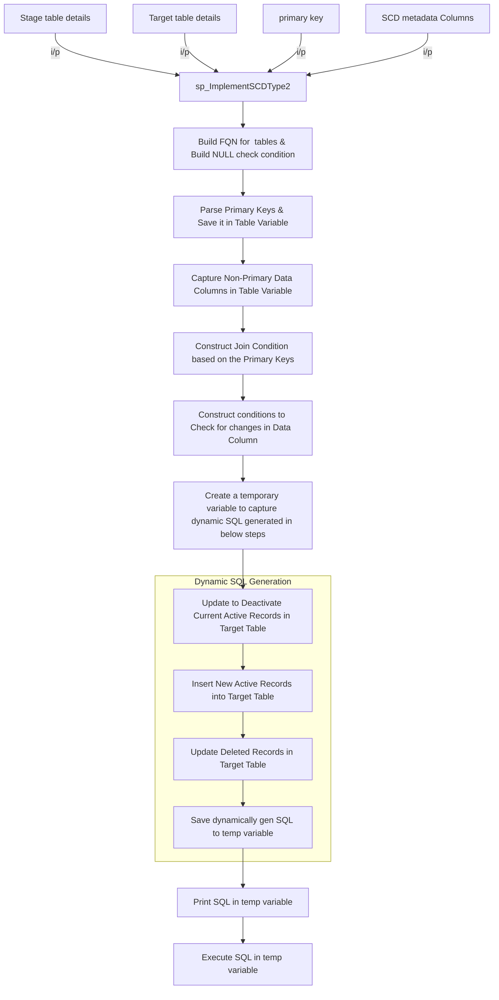

# Notes

## Merge Vs Insert,Update,Delete
1. MERGE statement runs insert, update, or delete operations on a target table from the results of a join with a source table.
2. MERGE statement is more readable than INSERT+UPDATE(+DELETE)
3. While testing or developing the MERGE logic it better to include the MERGE in a transaction block as mentioned below, so it easy to ROLLBACK incase of unexpected results.Follow below mentioned pattern inorder revert back the changes  does at target.
```SQL

BEGIN TRANSACTION T1;
MERGE #Test1 t  -- Target 
USING #Test2 s  -- Source 
ON t.ID = s.ID AND t.RowNo = s.RowNo 
  WHEN MATCHED 
    THEN     
      UPDATE SET Value = s.Value 
  WHEN NOT MATCHED 
    THEN       -- Target     
      INSERT (ID, RowNo, Value)     
        VALUES (s.ID, s.RowNo, s.Value);
SELECT 
  *
 FROM #Test1
 ORDER BY ID, RowNo;
ROLLBACK TRANSACTION T1; ---revert the changes done at the target
SELECT *
 FROM #Test1 
 ORDER BY ID, RowNo;

```
4. Merge is slower compared to UPSERT with (INSERT & UPDATE). As a rule of thumb, choose the individual INSERT operations and UPDATE operations, for syncing the large volume of data. Refer :[Merge Vs UPSERT performance](https://michalmolka.medium.com/sql-server-merge-vs-upsert-877702d23674)
5. `WHEN NOT MATCHED BY SOURCE 
    THEN
      DELETE` this  can result in deleting the records from target table that are not in `SOURCE`.To avoid this issue, try to extract the records from `TARGET` table that are there in `SOURCE` for MERGE operation. Refer this article [Hazard of Using the SQL Merge Statement](https://www.sqlservercentral.com/articles/a-hazard-of-using-the-sql-merge-statement)
6. ##### Handling UPDATES in SCD Type2 with Merge :
   `OUTPUT` clause returns a row for every row in target_table that's updated, inserted, or deleted, in no particular order. $action can be specified in the output clause. `$action` is a column of type `nvarchar(10)` that returns one of three values for each row: INSERT, UPDATE, or DELETE, according to the action done on that row and it is available only for `MERGE` statement. `$action`  is used in the SCD Type 2 implementation  to handle the records that are updated at the source.In SCD Type 2, for records with updates at the source, all corresponding records in the `target` table will be `UPDATED` from `active` to `inactive`. Then, the newly changed records from the source will be `inserted` into the table  as `active` records.Above mentioned,scenario of `UPDATES` can not be handled by single `MERGE` statement,since for one source row, you cannot do both  INSERT and an UPDATE.Suggested approach is to first `UPDATE` the matching records in target table to `inactive` using `MERGE` statement. Then use `OUTPUT` clause of `MERGE` to save the values of the `source` table. Also add the `$ACTION` column to the `OUTPUT` clause. Only the records with `UPDATES` is filtered and will be `INSERTED` into the `target` table.
Refer:[Handling updates in SCD type2 using Merge](https://learn.microsoft.com/en-us/answers/questions/1478100/scd-type-2-merge-update-and-insert)
```SQL

INSERT tbl (....)
SELECT ...
FROM   (MERGE ...
            OUTPUT $ACTION, SOURCE.col1, SOURCE.col2, ....) AS M
WHERE M."$ACTION""= 'UPDATE'
```
## Gotchas [OR] Best Parctises 
1. Create Index on the Column referenced  on `CONDITION`. Index needs to be on Target table and the index can be CLUSTERED(where records organized in a sorted fashion) or NON-CLUSTERED.
2. `Separate filtering from matching`. Ensure that the condition only compares columns across the two tables (e.g., target.user_id=source.u_id), not a column with a constant (e.g., source.account_status='ACTIVE'). Having a filter condition on `ON CLAUSE` can return unexpected and incorrect results. 
Ref:[ON <merge_search_condition>](https://learn.microsoft.com/en-us/sql/t-sql/statements/merge-transact-sql?view=sql-server-ver16#on-merge_search_condition)
##### Example:
```SQL

           MERGE target.CreditCardMaster AS T
		USING staged.CreditCardMaster S
		ON T.PAN = S.PAN AND T.ChangeDate = S.ChangeDate
  ------	AND T.IsActive = 1 Not a recommended approach 
		WHEN MATCHED AND 
		T.IsActive = 1    --- as per best practises
		AND
(T.CardPIN <> S.CardPIN OR T.AccountID <> S.AccountID OR T.CardHolderName <> S.CardHolderName
OR T.ExpiryDate <> S.ExpiryDate OR T.CreditLimit <> S.CreditLimit)
```


## Stored Procedure SCD Type2 control flow (without MERGE)

