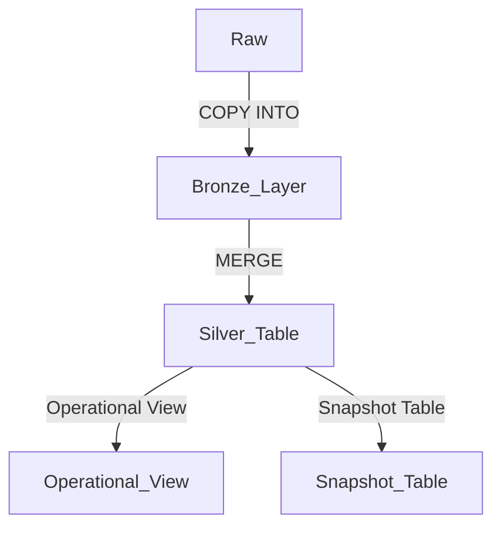

# Databricks Resources and Articles

## Auto Loader:
- [Accelerating Incremental Data Ingestion](https://blog.det.life/databricks-autoloader-series-accelerating-incremental-data-ingestion-9ce8dc44a70a)
- [Change Data Feed Review](https://afroinfotech.medium.com/my-review-of-databricks-delta-lake-change-data-feed-a06b56ef8036)
- [YouTube: Change Data Feed](https://www.youtube.com/watch?v=0gkHHokTg0U&t=29s)

## External Table + Unity Catalog:
- [YouTube: External Table and Unity Catalog Integration](https://www.youtube.com/watch?v=aAswROA1bM8)

## Integration of Delta File with Redshift Spectrum:
1) You need a **Manifest file** for registering with AWS Glue.
   - [Read More on Delta Lake Integration using Manifest](https://medium.com/@subhamkharwal/pyspark-delta-lake-integration-using-manifest-a91b0a291737)

## Integration with Glue Catalog:
- [AWS Glue Data Catalog Metastore Integration with Databricks](https://www.linkedin.com/pulse/aws-glue-data-catalog-metastore-databricks-deepak-rajak/)

## Compare Databricks Vs Snowflake:
- [Databricks vs Snowflake: Which Platform is Best for You?](https://rajanieshkaushikk.com/2023/04/21/databricks-vs-snowflake-which-platform-is-best-for-you/)
- [Schema Enforcement in Delta Lake](https://www.databricks.com/blog/2019/09/24/diving-into-delta-lake-schema-enforcement-evolution.html)
- [Munging Data: Schema Enforcement and Evolution](https://mungingdata.com/delta-lake/schema-enforcement-evolution-mergeschema-overwriteschema/)

## Job Cluster:
- [Evaluating Databricks Job Clusters and Workflows](https://afroinfotech.medium.com/evaluating-databricks-job-clusters-and-databricks-workflows-dd069255c83f?source=author_recirc-----cad1699ed013----2---------------------8ccc5810_0eb1_4e11_a7a6_883204855342-------)

## Time Travel with Delta Table:
- [YouTube: Time Travel with Delta Tables](https://www.youtube.com/watch?v=0cPX1e2vpLA&list=PLtlmylp_ZK5wr1lyq76h1V4ZuWZYThgy0&index=26)

## Understand Delta Lake:
- [5 Reasons to Use Delta Lake on Databricks](https://medium.com/datalex/5-reasons-to-use-delta-lake-format-on-databricks-d9e76cf3e77d)
- [Ganesh Chandrasekaran's Blog](https://ganeshchandrasekaran.com/)

## Delta Lake Optimization:
- [Keeping Delta Lake Fast and Clean](https://towardsdatascience.com/delta-lake-keeping-it-fast-and-clean-3c9d4f9e2f5e)
- [Open Source Delta Lake Updates](https://docs.delta.io/latest/delta-update.html)

## Time Travel vs History in Delta:
- [Delta Lake Time Travel and History Documentation](https://docs.databricks.com/delta/history.html#time-travel)

## Architecture and Interview Prep:
- [Interoperability for Analytics in Healthcare with Databricks](https://sqlofthenorth.blog/2023/12/09/delivering-interoperability-for-analytics-in-healthcare-with-databricks-part-1-ingestion-analysis/)

## Best Practices:
- [Delta Lake Best Practices](https://medium.com/@vijaygadhave2014/delta-lake-best-practices-f19465905f5d?source=read_next_recirc-----9a817756745a----1---------------------2f112cb5_29df_46d0_8279_bc231dfc3ec6-------)
- [How to Select Worker/Driver Type in Databricks](https://docs.databricks.com/en/compute/cluster-config-best-practices.html)

## When to Choose Memory Optimized vs Storage vs Compute Optimized:
- [Azure Databricks Workload Types: Data Analytics, Data Engineering, and Data Engineering Light](https://medium.com/microsoftazure/azure-databricks-workload-types-data-analytics-data-engineering-and-data-engineering-light-b1bb6d36c38c)

## Further Reading:
- [Azure Databricks Best Practices](https://github.com/Azure/AzureDatabricksBestPractices/blob/master/toc.md#Deploying-Applications-on-ADB-Guidelines-for-Selecting-Sizing-and-Optimizing-Clusters-Performance)
  
## Instance Type:
- [Choosing the Right Instance Type for Azure Databricks](https://medium.com/microsoftazure/azure-databricks-workload-types-data-analytics-data-engineering-and-data-engineering-light-b1bb6d36c38c)

## Reference:
- [Lakehouse Tacklebox GitHub](https://github.com/AbePabbathi/lakehouse-tacklebox)

## Accessing External Tables:
- [External Tables in Azure Databricks with Underlying Data in Azure Data Lake Gen 2](https://medium.com/walmartglobaltech/external-tables-in-azure-databricks-with-underlying-data-in-azure-data-lake-gen2-c45b9d81c6d5)

# **Terminology in Modern Data Architecture**

## **1. Data Lake**
- Data lakes emerged because **data warehouses** could not accommodate **unstructured data** efficiently and had **high storage and compute costs**.
- **2-tier architecture** is followed:  
  - All **raw data** resides in the **Data Lake**.  
  - **ETL is performed in the Data Warehouse**.

### **Drawbacks of Data Lakes**
- **Data Quality Issues**  
- **Data Governance Challenges**  
- **Lack of ACID compliance**  
- **Continuous engineering efforts** are required to maintain consistency between Data Lake and Data Warehouse  

✅ **These drawbacks were addressed in the Lakehouse Architecture.**

---

## **2. Data Warehouse**
- **Transformation occurs before loading** data into the warehouse (**Schema on Write**).  
- Schema must be **defined in advance**, which requires effort and **prior knowledge of use cases**.  
- Stores **cleaned and transformed** data with a catalog and schema.

### **Drawbacks of Data Warehouses**
- **High cost** due to coupled **storage & compute**.  
- **Does not support unstructured data** (Schema on Write enforced).  

✅ **These drawbacks were addressed using Data Lakes.**

---

## **3. Lakehouse Architecture**
- **Integrates Data Lake and Data Warehouse.**  
- **Historical data** resides in the **Data Lake**, while **current data** is available in the **Data Warehouse** for analytics.  
- The **primary goal** is to **prevent a data swamp** by introducing **Data Governance capabilities**.

	### **What is Data Governance?**
	- **Data Access Control** → Granting access to relevant users.  
	- **Data Access Audit** → Tracking data usage (e.g., Are multiple people creating the same report?).  
	- **Data Lineage** → Capturing **upstream sources and downstream consumers** to provide a **holistic view** of data flow.  
	- **Data Discovery** → Enabling users to **search and understand** the data easily.  

---

## **4. Medallion Architecture**
🔗 [Reference: Medallion Architecture - What,Why,How](https://medium.com/@junshan0/medallion-architecture-what-why-and-how-ce07421ef06f)  
🔗 [Good Reference - Advancing Analytics](https://www.youtube.com/watch?v=fz4tax6nKZM&t=99s)  

### **Layered Structure:**
| **Layer**     | **Description** |
|--------------|---------------|
| **Landing**  | Raw data from the **source** (unchanged) → Enables **easy replays and ad-hoc analysis** without relying on the source system. |
| **Raw**      | **Schema validation** (optional, previously not enforced). |
| **Base**     | **Cleansed and validated** data. |
| **Enriched** | **Conformed cleaned data**, includes **CDC (Change Data Capture) logic**. |
| **Curated**  | **Analytical model**, contains **Facts & Dimensions**, and is **structured for data modeling**. |
| **Semantic** | **Reporting model** optimized for BI tools. |

### **Medallion Layers - Bronze, Silver, Gold**
- **Bronze (B):** Raw data, same as the source.  
- **Silver (S):** Dimension tables, data quality improvements, and additional enrichment.  
- **Gold (G):** Similar to **Data Marts**, **optimized for read performance** with **denormalization and Kimball-style star schema integration**.  

---
# **Transactional Data in Data Lake**  

## **Overview**  
Modern **data lakes** face several challenges, which led to the development of **Apache Iceberg, Apache Hudi, and Delta Lake**. These formats are designed to solve:  

1️⃣ **Enable ACID transactions** in data lakes.  
2️⃣ **Consistent updates** → Prevent reads from failing or returning incomplete results due to concurrent writes.  
3️⃣ **Scalable data and metadata management** → Avoid bottlenecks in large tables with thousands of partitions and billions of files.  

🔗 **References:**  
- [Apache Hudi vs Delta Lake vs Apache Iceberg - Feature Comparison](https://www.onehouse.ai/blog/apache-hudi-vs-delta-lake-vs-apache-iceberg-lakehouse-feature-comparison)  
- [Transactional Data Lakes - Comparison](https://medium.com/geekculture/transactional-data-lakes-a-comparison-of-apache-iceberg-apache-hudi-and-delta-lake-9d7e58fd229b)  

---

## **Feature Comparison**  

| Feature                | **Apache Iceberg** | **Apache Hudi** | **Delta Lake** |
|------------------------|-------------------|----------------|---------------|
| **ACID Transactions**  | ✅ Yes | ✅ Yes | ✅ Yes |
| **Partition Evolution** | ✅ Yes | ❌ No | ❌ No |
| **Schema Evolution**    | ✅ Yes | ✅ Yes | ✅ Yes |
| **Time Travel**         | ✅ Yes | ✅ Yes | ✅ Yes (but limited if log files are deleted) |

🔹 **Time Travel in Delta Lake**:  
- If log files are deleted, it may **not be possible** to time travel to earlier points.  
- Example: If logs **1–30** exist, with a checkpoint at **log 15**, deleting **log 1** **disables** time travel to logs **1–14** since no earlier checkpoint is available.  

---

## **Final Verdict: Choosing the Right Format**  

### **🔹 Apache Iceberg**
✅ Best for **large tables** with a high number of partitions.  
✅ **Better metadata management** → Solves performance issues in **S3 object listing** or **Hive Metastore partition enumeration**.  
⚠️ **Limitations:** Limited support for **deletions and mutations**, and **some operational overhead** for data retention.  

### **🔹 Apache Hudi**
✅ **Best for mutating datasets** with multiple query engines.  
✅ **Pre-installed in AWS services** like **Athena, Glue, and EMR**.  
⚠️ **Limitations:** Requires **tuning for large-scale production**, and **developer experience** is not as polished as others.  

### **🔹 Delta Lake**
✅ **Best if you use Apache Spark**, especially with **Databricks**.  
✅ **Delta Engine** enhances read/write performance in Databricks.  
⚠️ **Limitations:** **Lower write throughput**, and **open-source Delta Lake** may lag behind **Databricks' Delta Engine**.  

---

🚀 **Conclusion**  
Choose **Iceberg** for **large tables and metadata efficiency**, **Hudi** for **mutating datasets across multiple engines**, and **Delta Lake** if **Apache Spark & Databricks** are your primary ecosystem.  

# **Inside Delta Lake**  
🔗 **Reference:** [What's Inside Delta Lake](https://medium.com/analytics-vidhya/whats-inside-delta-lake-35952a6c033f)  

## **Delta Lake Components**  
A **Delta table** is a **file directory** with two key components:  

### **1️⃣ Data Objects**  
📂 **Stored in Parquet format** → Holds the actual table contents.  

### **2️⃣ Transaction Log Files & Checkpoints**  
📜 **Transaction logs** track changes in the table:  
   - Each write operation creates a new transaction log.  
   - Stored in **JSON format**.  

✅ **Checkpoints** provide summarized snapshots of transaction logs:  
   - Stored in **Parquet format**.  
   - Helps in optimizing query performance.  

---

## **Delta Table Structure**  

| **Component**    | **Description** |
|-----------------|----------------|
| **Parquet Files** | Contain actual table data. |
| **_delta_log Folder** | Stores transaction logs and checkpoint files. |
| **JSON Files** | Represent each write operation (transaction). |
| **.crc Files** | Used for integrity checks. |

### **Transaction Logging in Delta Lake**
- Each **write operation** creates a **new JSON file** in the `_delta_log` folder.  
- Each **transaction log** contains an **array of actions** to apply to previous table versions.  
- The **checkpoints** allow Delta Lake to quickly reconstruct table states without scanning all logs.  

🚀 **Conclusion**  
Delta Lake maintains **data integrity and performance** by using **Parquet for data storage** and **JSON-based transaction logs** to track changes efficiently.  

# **Delta Lake vs Apache Hudi**  
🔗 **Reference:** [Apache Hudi vs Delta Lake](https://medium.com/swlh/apache-hudi-vs-delta-lake-295c019fe3c5)  

## **Common Features**  
✅ Both **Delta Lake** and **Hudi** create an **UPSERT abstraction** on top of **Parquet** format.  

---

## **Delta Lake Overview**  
📜 **Transaction Logs**:  
- JSON formatted log contains information about the latest **commit** and **schema**.  

🔄 **Change Data Capture (CDC) Merge**:  
- Multiple records can be **inserted, updated, or deleted** in a single operation.  
- The content of the **original Parquet file** is split into **multiple smaller Parquet files** which are then rewritten.  
- If the table is **partitioned**, only the **affected partition** is updated.  
- The **initial Parquet file still exists** but is **removed from the new log file**.  
- To **physically delete** outdated files, run the **`VACUUM`** command.  

- **`OPTIMIZE`** command merges smaller files into larger ones for **efficient reads**.  

🔗 **Further Reading:**  
- 📌 [Slowly Changing Dimensions (SCD) Type 2 in Delta](https://github.com/databricks/tech-talks/tree/master/2020-05-28%20%7C%20Slowly%20Changing%20Dimensions%20(SCD)%20Type%202)  
## **Hudi vs Delta: Key Differences**  
🔗 **Reference:** [Delta vs Hudi on Oracle Cloud](https://blogs.oracle.com/developers/post/deltalake-vs-hudi-on-oracle-cloud-infrastructure-part-1#:~:text=Hudi%20is%20slightly%20easier%20to%20work%20with%20as,and%20Merge-on-read.%20Only%20the%20former%20supports%20time%20travel.)  

# **Internals & Concepts of Delta Lake**  

## **Features**  

✅ **Convert Existing Parquet to Delta Table**  
- You can **convert existing Parquet files** into Delta format.  
- ⚠️ **Do not perform writes on the Parquet file** while converting to Delta.  
- 🔗 **Reference:** [Convert Parquet to Delta](https://docs.databricks.com/sql/language-manual/delta-convert-to-delta.html)  

✅ **Primary Keys**  
- Unlike traditional databases, **Delta tables do not support primary keys**.  

✅ **Schema Evolution**  
- **Adding New Columns:** Use `.option("mergeSchema", "true")` or set `spark.databricks.delta.schema.autoMerge.enabled = true`.  
- **Modifying Schema (Rename, Change Type, Drop Column):** Use `.option("overwriteSchema", "true")`.  
- **Explicit Schema Updates:** Use `ALTER TABLE` (requires **column mapping** to be enabled).  

✅ **Time Travel**  
- **Read constraints** exist to ensure only valid file versions are accessed.  
- To **time travel**, both **log files** and **data files** for that version must be retained.  

✅ **Caching Mechanisms**  
🔗 **Reference:** [5 Reasons to Use Delta Lake on Databricks](https://medium.com/datalex/5-reasons-to-use-delta-lake-format-on-databricks-d9e76cf3e77d)  
1. **Delta Cache:**  
   - Keeps **local copies** of remote data on worker nodes (applies only to **Parquet** files).  
   - Reduces **remote reads**, optimizing performance.  
2. **Result Cache:**  
   - Result cache  available in Delta cahce is a  caching feature of the Delta cache and  is the ability to cache a   subset of data. Once the query (and its results) is cached, subsequent queries executions avoid to read files (as much as possible).The result cache is automatically invalidated once of the underlying files is updated or if the cluster is restarted.

---

## **Optimization Techniques**  

🔹 **File Management:**  
- **Goal:** Reduce the number of small files for **better read performance**.  
- **Commands:**  
  - **`OPTIMIZE`**: Merges smaller files into larger ones.  **OPTIMIZE BY Z-ORDER**, regroup all  the data associated with selected columns into single files
  - **`VACUUM`**: Deletes **stale transaction logs** and old data files (default retention is **7 days**). 
		- It  looks for MODIFICATION TIME of the file and delete it. Not the timestamp related information in  TRANSACTION logs 

🔹 **Z-Order Optimization**  
- **Purpose:** Optimizes column storage for **high-cardinality columns**.  
- **Key Points:**  
  - Only the **first 32 columns** are indexed by default. Adjust `delta.dataSkippingNumIndexedCols` to change the number of columns.Have in mind that this can affect write performance, especially for
         **long strings** for which it is advised to move them to the **end of the schema and set the property to a number lower than its index.**
   - **Multiple columns** can be used for Z-Order, but effectiveness **decreases with more columns**.  

🔹 **Partitioning Strategy**  
			- **Use low-cardinality columns** (e.g., **Gender, Region**).  

🔹 **Deletion Vectors (DV)**  

🔗 **Reference:** [Optimizing PySpark Workloads with Deletion Vectors](https://freedium.cfd/https://medium.com/@omarlaraqui/optimizing-pyspark-workloads-with-deletion-vectors-in-databricks-a-comprehensive-guide-99f37a583a23#:~:text=Deletion%20Vectors%20are%20a%20more%20sophisticated%20approach%20that%20allows%20Databricks)  

✅ **What is a Deletion Vector?**  
- Delta tables use **immutable Parquet files**, meaning records **cannot be deleted directly**.  
- **Before DV:** The entire Parquet file had to be **rewritten** after a delete operation.  
- **With DV:** A `.bin` file is created to track **deleted records** instead of rewriting Parquet files.  

✅ **Requirements:**  
- **Databricks Runtime ≥ 14.1** (enabled by default).  
- **Delta Lake 2.3.0 (SCAN) & DELETE (2.4)** support DV in **UPDATE** and **MERGE**.  

✅ **How DV Works?**  
- The `.bin` file **tracks deleted records** without modifying the Parquet file.  
- **Delta Reader** automatically **excludes deleted records** when reading data.  
- So in the maintanence window, all the records should be deleted from the PARQUET. It is applied in following scenarios:
              - A DML command with deletion vectors disabled (by a command flag or a table property) is run on the table.
              - An ``OPTIMIZE`` command is run on the table.
              - ``REORG TABLE ... APPLY (PURGE)`` is run against the table.This is an **idempotent operation.**

✅ **Gotchas:**  
- Too many `.bin` files **degrade query performance**.  
- Best practice: Run **`OPTIMIZE`** or **`REORG TABLE ... APPLY (PURGE)`** during maintenance.  

---

## **When Not to Use Delta Lake?**  

❌ **Read-Only Datasets**  
- If **data integrity is not a concern**, Delta Lake may be **overkill**.  

❌ **High Read-Only Workloads**  
- **Columnar formats like Parquet** might perform better if **updates are infrequent**.  

❌ **Incompatibility with Legacy Systems**  
- If **downstream consumers do not support Delta**, conversion might cause **integration issues**.  

# **Usecase - Delta Lake - COPY INTO & SCD Type 2**  

🔗 **Reference:** [SCD Type 2 on Databricks SQL Serverless](https://medium.com/dbsql-sme-engineering/scd-2-warehousing-design-pattern-on-databricks-sql-serverless-9a817756745a)  

## **Architecture**  
## **Data Flow in Delta Lake**  

✅ **Snapshot Table:**  
- Can be used **optionally** or **leveraged via time travel functionality** based on requirements.  

---

## **COPY INTO**  
- ✅ Supports **Incremental & Non-Incremental** file loads.  
- ✅ Use **AUTOLOADER** for **large numbers of files**.  
- ✅ Allows specifying **up to 1000 filenames**.  
- ✅ Supports **Schema Evolution**.  
- ✅ Ignores **corrupt files**.  
- ✅ **MergeSchema is supported**.  

---

## **Slowly Changing Dimension (SCD) Type 2**  
⚠️ **Important Note:**  
- ❌ **Do NOT use a separate `INSERT` statement with `MERGE`**, as it causes inconsistencies.  
- ✅ **Use the ATOMIC version of `MERGE`** (as explained in the referenced post).  

---

## **Databricks Workflow for SCD Type 2**  
✅ **Run via:**  
- SQL Files  
- Query Objects in **Databricks SQL (DBSQL)**  

---

## **Optimization Techniques**  

### **1️⃣ After MERGE - Run `ANALYZE`**  
- Remember this **Not Incremental**  
- Ensures **statistics are updated** for optimized query performance.  

### **2️⃣ OPTIMIZE with Z-ORDER BY**  
- **Improves read performance** at the **consumption layer**.  
- **Incremental Optimization**  

### **3️⃣ Snapshot Table Strategy**  
- Run **Quarterly or Half-Yearly** based on requirements.  
- Use **Serverless Warehouse** for efficient snapshot computation.  
> This makes for extremely price/performant auditing, especially when operational dashboards only use a subset of data, and the snapshots need to process a large amount of data.  Because of this design, operational dashboards can use much smaller warehouses, and the historical snapshots can be built on larger warehouses than are only on during the snapshot process.

# Delta - Update the Table

## Overwrite:
- Each write operation would create a parquet file  
- Latest parquet file has only current records  
- If first write has 100 records, after 2nd write has only 4 records, there will be a parquet file created and 2nd parquet will have only 4 records  

## Append:
- Same as Overwrite  
- For example:  
  - First write 100 records → 1 parquet file will be created  
  - 2nd write 4 records → Another Parquet file with only 4 records, not 104 records
  
# Delta - UPSERT

## When You Need This Feature:
Delta Lake merge is ideal for when you want to apply selective changes to a Delta table without rewriting the entire table.  
In a normal Parquet table, the entire data would be rewritten.

## Merge Operations:
- `whenMatchedInsertAll`, `whenMatchedUpdateAll`:  
  - Use when the source and target schema matches.  
  - This can work when **Schema Evolution** is enabled.  
- `whenMatchedUpdate`:  
  - Modify the columns mentioned.  
- `whenMatchedDelete`:  
  - Remove the row associated with the match.  
- `WHEN NOT MATCHED BY SOURCE`:  
  - Supported from **Delta 2.3**, and **SQL from 2.4**.  

## Merge Failure:
- A merge operation can **fail** if multiple rows of the source dataset match and the merge attempts to update the same rows of the target Delta table.  

## Schema Validation:
- For **update** and **insert** actions, the specified target columns must exist in the target Delta table.  
- For **updateAll** and **insertAll** actions, the **source dataset must have all the columns** of the target Delta table.  
  - The source dataset **can have extra columns**, and they are ignored.  
  - Enable **Automatic Schema Evolution** to have extra columns available in the target table.  

## Automatic Schema Evolution:
- **A column in the source table is not present in the target table**  
  - The new column is added to the target schema, and its values are inserted or updated using the source values.  
- **A column in the target table is not present in the source table**  
  - The target schema remains unchanged.  
  - The values in the additional target column are either left **unchanged (for UPDATE)** or set to **NULL (for INSERT)**.  

## DELETE Records from Target:
- For **versions < 2.3**, additional steps are needed to filter the deleted records and use `whenMatchedDelete`.  

# MergeSchema - Overwrite Schema

- **Delta table is Schema on Write.**  
- If `MergeSchema` is **not set**, by default **Delta file format supports Schema Enforcement**.  
- Even if `MergeSchema` is set to **True**, it is observed that:  
  - On the **first load**, if a column is written as `StringType`, and  
  - On the **second load**, if the same column is written as `IntegerType`,  
  - **Delta Write will fail.**  

# Databricks

## Control Plane
- **Databricks Cloud Account**  
  - Contains:  
    - Web Application  
    - Repos/Notebooks  
    - Job Scheduling  
    - Cluster Management  

## Data Plane
- **Customer Cloud Account**  
  - Contains:  
    - Apache Spark Clusters  
    - DBFS (Databricks File System)  

---

# Databricks - Cluster

## Cluster Types
- **Interactive Cluster**  
  - Used for development and interactive workloads.  
  - Retains a maximum of **70 clusters for 30 days**.  

- **Job Cluster**  
  - Tied to Databricks jobs.  
  - Spins up when the job starts and shuts down automatically after completion.  
  - Retains a maximum of **30 clusters**.  

---

## Cluster Modes
- **Standard Mode**  
  - Suitable for **single users or small groups**.  
  - Supports **all programming languages**.  

- **High Concurrency Mode**  
  - Optimized for **minimizing latency in high-concurrency workloads**.  
  - **Note:**  
    - High Concurrency clusters **do not automatically set the auto shutdown field**, whereas Standard Clusters default to **120 minutes**.  

---

## Databricks Pool
- **Databricks pools** reduce **cluster startup times** by maintaining a **set of idle virtual machines** in a ‘pool’.  
- These VMs only incur **Azure VM costs**, **not Databricks costs**.  
- If an **autoscaling cluster** is attached to a pool, **scaling up is much quicker**, as nodes can be added from the pool instead of being freshly provisioned.  

---

## Databricks Runtime Versions
- **Standard Runtime**  
- **Machine Learning Runtime**  
- **Genomics Runtime**  

---

## Autopilot Options
- **Autoscaling**  
- **Terminate after X minutes of inactivity**  

# Surrogate Keys

## Definition
In **dimensional modeling**, **surrogate keys** are uniquely generated identifiers used to identify rows in a **dimension table**.  

## Generating Surrogate Keys in Apache Spark
Surrogate keys can be generated using:  
- `monotonically_increasing_id()`  
- `row_number()`  
- `RANK() OVER`  
- `zipWithIndex()`  
- `zipWithUniqueIndex()`  
- **Row Hashing**  
  - `hash()`  
  - `md5()`  

---

## Generating Surrogate Keys in Delta Lake
Delta Lake provides **identity columns** for surrogate key generation:  
- **`GENERATED ALWAYS AS IDENTITY`**  
  - Automatically generates an identity column that **cannot be overridden**.  

- **`GENERATED BY DEFAULT AS IDENTITY`**  
  - Allows identity values to be overridden during insertion.  

---

## Caveats
- **Identity columns cannot be added to existing tables**.  
- **To include an identity column, the table must be recreated**.  

# Unity Catalog

**Reference:**  
[Unity catalog creation ](https://www.youtube.com/watch?v=EHTQ00kZxwI&list=PLtlmylp_ZK5wZX4wPp4OUh1uL1YVOOzpl&index=2)  

## Key Features
- **Three-Level Namespace**  
  Unity Catalog follows a **three-level namespace** structure:
  - **Catalog** → **Schema** → **Tables**  
  - Example:
    - Create a catalog called **`sales_data`**.
    - Within this catalog, create schemas per sales region: **`north`**, **`south`**, **`east`**, **`west`**.
    - Inside each schema, create tables per quarter: **`Q1_2020`**, **`Q2_2020`**, **`Q3_2020`**, **`Q4_2020`**.  
    - Each table contains **region and quarter-specific** data.  

  This structure improves **data organization and access control**.

- **More Granular Control**  
  Unity Catalog provides **fine-grained permissions** at the **catalog, schema, and table** levels.

- **Global Account Admin Required**  
  - To configure a Unity Catalog (UC) account, you must be a **global account admin**.

- **Regional Constraints**
  - **One Unity Catalog per region**.
  - **Each workspace can have only one Unity Catalog**.
  - **One Unity Catalog can be attached to multiple workspaces**.
  - **A Unity Catalog created in region X cannot be assigned to a workspace in region Y**.

---

## Setting Up Unity Catalog (Azure)
### **Prerequisites**
- You must have **Owner** or **Account Global privileges**.

### **Steps to Set Up**
1. **Create a Storage Account**.
2. **Enable Databricks as a Premium Tier Service**.
3. **Create an Access Connector**.
   - Requires **Managed Identity** (MI) for **secure access** to the storage container.
   - **Why Managed Identity?**  
     - Eliminates the need to **manage credentials**.  
     - **No need to rotate secrets**.
4. **Assign Storage Blob Contributor Role** to **Access Control**.
5. **Create a Metastore**.
---
# Databricks Workflow

**Reference:**  
[Basics of Databricks Workflows - Part 1](https://community.databricks.com/t5/technical-blog/basics-of-databricks-workflows-part-1-creating-your-pipeline/ba-p/54397)  

## **Key Features**
### **1. Spark-Submit Task**
- Runs **spark-submit tasks** only on **new clusters**.

### **2. Concurrency Limit**
- Concurrency limits can be **overcome by enabling queueing**.
- Jobs will **remain in the queue for up to 48 hours**.

### **3. One-Time Run & Trigger Once**
- Submit a **one-time run** without creating a job.
- Runs submitted via this method **do not appear in the UI**.
- Use **`jobs/runs/get` API** to check the run state **after submission**.

### **4. Repair Run**
- Allows **re-running only failed tasks**.
- Can be triggered via **REST API**.

### **5. Get Status of All Tasks in a Workflow**
- Check **task execution status** in a Databricks workflow:  
  [Stack Overflow Reference](https://stackoverflow.com/questions/63018871/how-do-you-get-the-run-parameters-and-runid-within-databricks-notebook).

### **6. Passing Values Between Tasks**
- Share context between tasks:  
  [Databricks Documentation](https://docs.databricks.com/en/workflows/jobs/share-task-context.html).

### **7. Job Metadata Information**
- Reference job parameter values:  
  [Databricks Documentation](https://docs.databricks.com/en/workflows/jobs/parameter-value-references.html).

---

## **Limitations**
- **REST API Rate Limits**  
  - Example: **`get_job` API cannot be called more than 100 times per second**.  
  - Exceeding the limit results in a **429 response status code**.

- **Concurrent Task Limit**
  - A Databricks **workspace supports only 1,000 concurrent task runs**.
  - Workaround:  
    - **Include smaller objects as tasks within a workflow**.
    - **Remember:** A **single workflow** can have **only 100 tasks**.

# Databricks Reading from S3

## **S3 Authentication**
There are two main methods for authenticating to S3:

### 1. **Instance Profile**
- Databricks can automatically authenticate using an **instance profile** attached to the cluster. This method uses the **IAM role** associated with the EC2 instance running the Databricks cluster to access S3.

### 2. **Set Access Key in Hadoop Configuration**
- If the instance profile is not used, you can manually configure the **AWS access key** and **secret key** in the Hadoop configuration for S3 access.

# Databricks Data Collection

## **Option 1 - Partner Ingestion Network**
- This option involves using a **partner ingestion network** to collect and load data into Databricks. These networks often provide integration with multiple data sources and can handle various data formats.

## **Option 2 - Use Native Cloud-Based Ingestion Tools**
- **In AWS**: Use **Database Migration Service (DMS)** to load transactional data into **Delta** format on Databricks.
- **In Azure**: Use **Azure Data Factory's Copy Activity** to load data into the **Data Lake**, where it can be processed and transformed as needed.

## **Option 3 - Use Custom Configuration Driven Spark Application**
- This method allows you to create **custom Spark applications** tailored to your specific ingestion needs. The configuration can be adjusted based on the type of data, frequency, and processing required.

# Platform Administration

- **Azure Databricks** is a first-party service, meaning that if any issues arise, **Azure support** will be responsible for troubleshooting and resolution.

## **Planning for Azure Databricks Workspace**

1. **Purpose and Life Cycle Needs of Your Azure Databricks Workspace**:
    - Determine if the workspace is needed for a **short-term project** or for **long-term use**.

2. **Is a Public IP Necessary?**
    - Public IPs are **expensive**, and once deployed, they cannot be changed.
    - For **Private IPs**, consider how communication will be established.

3. **What Are the Security and Access Requirements?**
    - Evaluate what security measures and access controls will be necessary to meet compliance or operational needs.

4. **Are There On-Premise Systems and Services It Should Connect With?**
    - Identify any existing on-premise systems that need to be connected to the Databricks workspace.

5. **How Will Access Be Monitored and Restricted?**
    - Plan how you will **monitor access** and **restrict unauthorized users** using role-based access control (RBAC) or other security methods.

6. **Will You Be Using Unity Catalog?**
    - Consider if **Unity Catalog** will be used for data governance and fine-grained access controls across workspaces.

7. **Storage Account for Data**:
    - Plan for a **storage account** to store the data used by Databricks. This could be an **Azure Data Lake Storage** or another cloud storage solution.

8. **If Using VNet Ingestion, an Existing or Newly Created VNet**:
    - Decide whether to use an **existing Virtual Network (VNet)** or create a **new one** for network communication.

# DLT (Delta Live Tables)

## Read:
[Delta Live Tables: A Case for Workflow for Lakehouse Integrating Source Data](https://medium.com/@lackshub/a-case-for-delta-live-table-as-the-workflow-for-lakehouse-integrating-source-data-f4de1b777cad)

## Notes:
1. **CREATE OR REFRESH LIVE TABLE** syntax to create a materialized view is **deprecated**. Instead, use **CREATE OR REFRESH MATERIALIZED VIEW**.
2. Observed that **DLT in AWS** is **cheaper** compared to the one in **Azure** and **GCP**.
3. Once the DLT pipeline is created, it is **not possible** to change the configuration related to **LOCATION**.

## Caveats:
- **Simple Streaming using DLT Core** is cheaper compared to **Structured Streaming in Notebook**. (Needs validation)
- You can retain a **history of records** either on all updates or on updates to a specified set of columns by just setting the **enableTrackHistory** parameter in the configuration.
- **Data Quality rules or expectations** come with **double the cost**.
- **Limit to CPU**:
    >  -  On typical Azure subscriptions, there is a limit to CPUs available: anytime a new VM is deployed, the vCPUs for the VM must not exceed the vCPU quota for the VM size family or the total regional vCPU quota. DLTs scale up quickly, but they consume a lot of CPU: even the maintenance pipelines scale up to 30 vCPUs for a few seconds to do their jobs, and this is not sustainable for organizations that have either mutualized Databricks workspaces for many projects and/or strict limits to their CPU availability.
    
    Read more: [Caveats Around Delta Live Tables (DLT)](https://medium.com/@lackshub/caveats-around-delta-live-tables-dlt-c9c4ac51d319)

## DLT with Unity Catalog (UC):
### Theory:
Read more: [Unity Catalog - Delta Live Tables](https://learn.microsoft.com/en-us/azure/databricks/delta-live-tables/unity-catalog)

1. A **single DLT pipeline** cannot write to both **Hive Metastore** and **Unity Catalog**.
2. Tables created in your pipeline can also be queried from shared Unity Catalog clusters using **Databricks Runtime 13.3 LTS** and above or a **SQL warehouse**. Tables cannot be queried from assigned or no isolation clusters.
3. **PROD Implementation**: Only the **Pipeline owner** and **Workspace admin** can see the driver logs created by DLT pipeline. To allow other users to view, configure the settings as per [Driver Log Permissions](https://learn.microsoft.com/en-us/azure/databricks/delta-live-tables/settings#driver-log-permissions).
4. Existing pipelines that use the **Hive Metastore** cannot be upgraded to use **Unity Catalog**.
5. **Single-node clusters** are not supported with Unity Catalog-enabled pipelines. Since DLT might create a single-node cluster to run smaller pipelines, your pipeline might fail with an error message referencing single-node mode.
6. **Important**: The underlying files supporting materialized views might include data from upstream tables (including possible personally identifiable information) that do not appear in the materialized view definition. This means it can expose sensitive data even if it's not part of the definition. It is recommended **not to share the underlying storage with untrusted downstream consumers**.
7. When a **table is removed** from a DLT pipeline, it will be removed from UC, but the data will be available for some time.
8. Deleting the **Delta Live Tables pipeline** results in the deletion of all tables defined in that pipeline. Because of this change, the Delta Live Tables UI is updated to prompt you to confirm the deletion of a pipeline.
9. **PROD Implementation**: By default, the tables created by a pipeline can be queried only by the pipeline owner. You can give other users the ability to query a table by using **GRANT** statements and revoke access using **REVOKE** statements.
10. When creating **materialized views** over source tables that contain row filters and column masks, the refresh of the materialized view is always a **full refresh**.

### Delta Live Table Schema Evolution:
Read more: [How to Manage Schema Evolution in DLT Streaming Pipelines](https://community.databricks.com/t5/technical-blog/how-to-manage-schema-evolution-in-dlt-streaming-pipelines/ba-p/71113#:~:text=What%20is%20Schema%20Evolution%3F,Catalog%20within%20the%20Databricks%20Lakehouse.)

## Simple Use Case:
- [AWS DMS + DLT](https://github.com/databricks/delta-live-tables-notebooks/tree/main/dms-dlt-cdc-demo)
- [API + DLT](https://github.com/databricks/delta-live-tables-notebooks/tree/main/divvy-bike-demo)
- [Good Use Case for Unpacking the TAR File](https://github.com/databricks/delta-live-tables-notebooks/tree/main/mapInPandas-dlt-ingestion)

### Architecture & Interview Questions:
- [Financial Services Examples - Personalization](https://github.com/databricks/delta-live-tables-notebooks/tree/main/financial-services-examples/Personalization)

### Additional Readings and Documentation:
- [Caveats Around Delta Live Tables (DLT)](https://medium.com/@lackshub/caveats-around-delta-live-tables-dlt-c9c4ac51d319)
- [Azure DLT Documentation](https://learn.microsoft.com/en-us/azure/databricks/delta-live-tables/settings#specify-a-storage-location)

### Issues Faced in Running the DLT:
- **DLT ERROR CODE**: EXECUTION_SERVICE_STARTUP_FAILURE - Failure to initialize configuration for storage account **dbrickexternaldev.dfs.core.windows.net**: Invalid configuration value detected for **fs.azure.account.key**.

# Databricks to ADLS Gen 2

1. **Mentioning the Access Key**:
   - **Drawback**: You can connect to only **1 bucket**.

2. **Using Service Principal (SP)**:
   - **Pros**: Using a Service Principal, we can access **multiple storage accounts**.