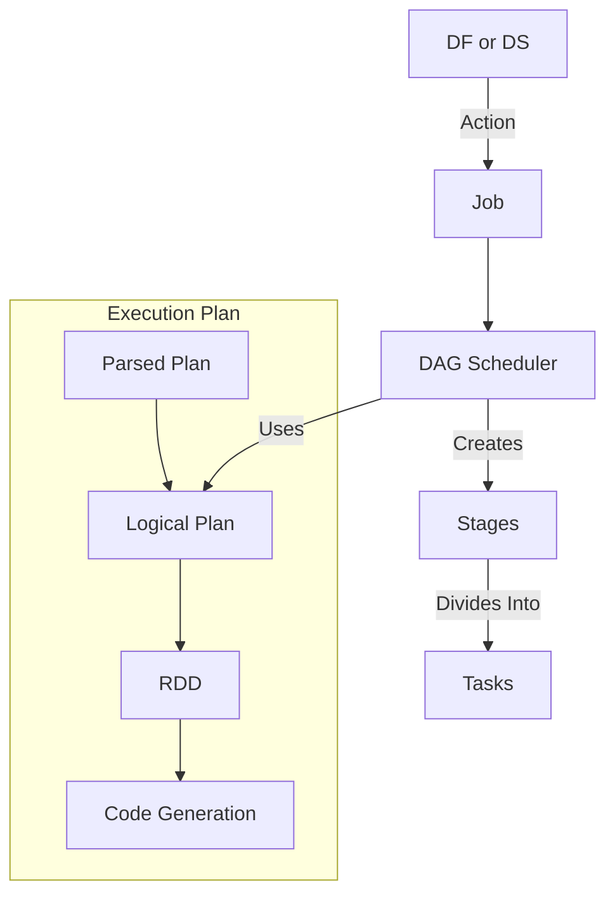

# **Data Engineering Resources**

## **1. Data Engineering**
- [Big Data Course](https://www.gousios.gr/courses/bigdata/)

## **2. DataFrame Use Cases**
- [Carol McDonald's GitHub](https://github.com/caroljmcdonald)
- [ETL Pipeline using Spark SQL](https://medium.com/analytics-vidhya/etl-pipeline-using-spark-sql-746bbfae4d03)

## **3. Best Practices for Writing Code**
- [Using JDBC in Apache Spark SQL](https://medium.com/@radek.strnad/tips-for-using-jdbc-in-apache-spark-sql-396ea7b2e3d3)
- [Explaining Apache Spark in a Non-Technical Way](https://towardsdatascience.com/explaining-technical-stuff-in-a-non-techincal-way-apache-spark-274d6c9f70e9)

## **4. Architecture and Streaming**
- [Kappa Architecture for Data Stream Processing](https://eng.uber.com/kappa-architecture-data-stream-processing/)
- [CDC at Scale using Spark](https://github.com/avensolutions/cdc-at-scale-using-spark)

## **5. Slowly Changing Dimensions (SCD)**
- [Spark SCD Implementation](https://github.com/sahilbhange/spark-slowly-changing-dimension)
- [Hive SCD Examples](https://github.com/cartershanklin/hive-scd-examples)
- [Updating Hive Tables](https://blog.cloudera.com/update-hive-tables-easy-way-2/)
- [SCD Type 2 using PySpark in AWS](https://towardsdatascience.com/processing-a-slowly-changing-dimension-type-2-using-pyspark-in-aws-9f5013a36902)
- [SCD Type 2 in Apache Spark](https://medium.com/@jafeer/slowly-changing-dimensions-scd-type-2-and-effective-ways-of-handling-it-in-apache-spark-a04ba235284b)

## **6. Hive**
- [Handling Incremental Updates in Hive](https://advanceanalyticsblog.wordpress.com/2017/04/07/handling-incremental-updates-in-hive/)

## **7. Spark Frameworks**
- [Spark Frameworks Overview](https://vinyasshetty.gitbooks.io/spark/content/spark-frameworks.html)
- [SCD Type 2 Implementation in Spark (Stack Overflow)](https://stackoverflow.com/questions/54058951/how-to-implement-slowly-changing-dimensions-scd2-type-2-in-spark)

## **8. Parallel Execution of Spark Jobs**
- [Parallel Execution in Spark (YouTube)](https://www.youtube.com/watch?v=WZ5TJUYWyU0)
- [Spark Log Processing](https://www.gousios.gr/courses/bigdata/assignment-spark-solutions-scala.html)

## **9. Performance Tuning**
- [Converting Nested JSON to CSV in Spark](http://timepasstechies.com/spark-converting-nested-json-to-csv/)
- [Aggregation Techniques in Apache Spark](https://medium.com/swlh/five-ways-to-perform-aggregation-in-apache-spark-1cdf1651ced4)

## **10. Exception Handling in Spark**
- [Exception Handling in Spark DataFrames](https://anish749.github.io/spark/exception-handling-spark-data-frames/)

## **11. PySpark Dependency Management**
- [Packaging PySpark Code with PEX](https://medium.com/criteo-labs/packaging-code-with-pex-a-pyspark-example-9057f9f144f3)
- [Managing Python Dependencies in PySpark](https://databricks.com/blog/2020/12/22/how-to-manage-python-dependencies-in-pyspark.html)

## **12. Working with JSON in Spark**
- [JSON Handling in Apache Spark](https://medium.com/expedia-group-tech/working-with-json-in-apache-spark-1ecf553c2a8c)

## **13. JDBC Connectivity**
- [Spark-VERTICA Connector and JDBC Read/Write](https://bmwieczorek.wordpress.com/2020/02/04/spark-vertica-connector-and-jdbc-read-write/)

## **14. Optimizing Spark Jobs**
- [Key Factors for Spark Job Optimization](https://medium.com/datakaresolutions/key-factors-to-consider-when-optimizing-spark-jobs-72b1a0dc22bf)

## **15. PySpark Practice**
- [PySpark Dataset Repository](https://github.com/azar-s91/dataset)
- [Common PySpark Transformations](https://bennyaustin.com/2020/10/07/pyspark-common-transforms/)
- [PySpark Utils Repository](https://github.com/bennyaustin/pyspark-utils/blob/main/CommonTransforms/CommonTransforms.py)
- [Complete Guide to PySpark DataFrames](https://towardsdatascience.com/the-most-complete-guide-to-pyspark-dataframes-2702c343b2e8)

## **16. Sessionizing Events**
- [Computing Sessions in BigQuery](https://medium.com/swlh/computing-session-for-event-data-using-google-bigquery-4316e35a832b)

## **17. Log Extraction**
- [Log Data Processing with Apache Spark](https://opensource.com/article/19/5/log-data-apache-spark)

## **18. User-Defined Aggregate Functions (UDAF)**
- [Custom UDAF in Spark](https://medium.com/teads-engineering/apache-spark-udaf-could-be-an-option-c2bc25298276)

## **19. Apache Arrow and Pandas UDFs**
- [Improve PySpark Performance using Pandas UDF with Apache Arrow](https://kontext.tech/column/spark/370/improve-pyspark-performance-using-pandas-udf-with-apache-arrow)
- [Apache Arrow in Spark (YouTube)](https://www.youtube.com/watch?v=JWQxd3YKWhs)
- [Vectorized UDFs in PySpark](https://databricks.com/blog/2017/10/30/introducing-vectorized-udfs-for-pyspark.html)

## **20. Understanding Spark Internals**
- [Efficient UDFs in PySpark](https://florianwilhelm.info/2017/10/efficient_udfs_with_pyspark/)
- [Spark Notes](https://tanmaybinaykiya.github.io/spark-notes)
- [Spark Gotchas](https://github.com/zero323/spark-gotchas)

## **21. PySpark ETL Development**
- [Building Production PySpark Jobs](https://medium.com/@lubna_22592/building-production-pyspark-jobs-5480d03fd71e)

## **22. Schema Evolution in Hive**
- [Schema Evolution at Slack](https://slack.engineering/data-wrangling-at-slack/#.4hww668rz)
- [Evolving Schema in Parquet with Hive](https://nilanjansarkarblog.wordpress.com/2018/12/27/evolving-schema-with-parquet-files-in-hive/)

## **23. File Formats in Big Data**
- [Comparison of Big Data File Formats](https://blog.clairvoyantsoft.com/big-data-file-formats-3fb659903271)

## **24. Data Engineering Interview Questions**
- [3 Important Data Engineering Interview Questions](https://betterprogramming.pub/3-questions-you-should-be-able-to-answer-in-a-data-engineering-interview-8dc845785be6)

## **25. Spark Optimizations and Parallelism**
- [Efficient Executor Configuration for Apache Spark](https://medium.com/expedia-group-tech/part-3-efficient-executor-configuration-for-apache-spark-b4602929262)
- [Parallelizing Spark Jobs](https://joshua-robinson.medium.com/sparks-missing-parallelism-loading-large-datasets-6746906899f5)
- [JDBC Parallelization Techniques](https://jozef.io/r926-spark-jdbc-partitioning/)

## **26. Data Quality and Observability**
- [Data Observability and Metadata Collection](https://medium.com/cj-express-tech-tildi/data-observability-metadata-collection-d45bcfb53a4a)
- [Data Quality Talks (YouTube)](https://www.youtube.com/watch?v=_ra67du8BMY)

## **27. Python Logging in Spark**
- [Python Logging Guide](https://www.pylenin.com/blogs/python-logging-guide/)
- [Logging from Executors in PySpark](https://stackoverflow.com/questions/40806225/pyspark-logging-from-the-executor)

This list covers a variety of Spark, PySpark, and Data Engineering topics, providing insights into optimizations, best practices, and debugging techniques.

# Yarn Scheduler

## Reference Links
- [Configure Hadoop YARN CapacityScheduler on Amazon EMR](https://aws.amazon.com/blogs/big-data/configure-hadoop-yarn-capacityscheduler-on-amazon-emr-on-amazon-ec2-for-multi-tenant-heterogeneous-workloads/)
- [Deep Dive into YARN Scheduler Options](https://karthiksharma1227.medium.com/deep-dive-into-yarn-scheduler-options-cf3f29e1d20d)


## When Do We Use Yarn Scheduler?
YARN Scheduler is used when managing **shared clusters** with different types of workloads. Key scenarios include:
- **Heterogeneous resource consumption patterns** (computation-bound, I/O-bound, or memory-bound jobs).
- **Multi-team environments**, where jobs need an **agreed-upon share of cluster resources**.
- **Cluster admins handling one-time job requests** without affecting scheduled jobs.
- **Ensuring fair usage** where users do not consume resources beyond their allocated capacity.


## Types of Scheduling in YARN

### 1. **FIFO (First In, First Out)**
   - Processes jobs in the order they arrive.
   - **No concept of priority**, leading to **potential starvation** for smaller jobs.

### 2. **Fair Scheduler**
   - Assigns resources based on **priority**.
   - **Preemptive scheduling** ensures fair distribution.
   - **Ideal for small and mid-range clusters**.

#### **Example of Fair Scheduling**
> Consider two queues: **Queue A** and **Queue B**.
> - **Job 1** is submitted to **Queue A** and initially consumes all cluster resources.
> - Later, **Job 2** is submitted to **Queue B**, triggering **fair share preemption**, redistributing resources equally between both jobs.
> - When **Job 3** is added to **Queue B**, the scheduler ensures **equal resource allocation** within the queue.


### 3. **Capacity Scheduler**
   - **Uses resource calculation algorithms** to allocate resources to the **ApplicationMaster**.
   - Ensures users get **only their assigned capacity** without exceeding limits.


## What is Capacity Scheduler?
Capacity Scheduler uses **resource calculator algorithms** for dynamic resource allocation:

1. **DefaultResourceCalculator**:
   - Allocates resources **based on memory** alone.

2. **DominantResourceCalculator (DRF)**:
   - Allocates based on **job type** (CPU-bound, I/O-bound, or memory-bound).
   - **Max-min fairness** across dominant resource shares.

> *Example:*  
> - **Computation-bound job → CPU is dominant resource**  
> - **I/O-bound job → Bandwidth is dominant resource**  
> - DRF **maximizes the smallest dominant share first**, ensuring balanced allocation.


## **Project Setting**
- **Capacity Scheduler** enabled.
- **Resource calculator algorithm**: `DefaultResourceCalculator`.

---
# Spark 3.x Features

## **Dynamic Partition Pruning (DPP)**

### **References**
- [Video Explanation](https://www.youtube.com/watch?v=W9yo0bnf0ss)
- [StackOverflow Discussion](https://stackoverflow.com/questions/58412143/dynamic-partition-pruning-not-clear)
- [Dynamic Partition Pruning -Medium Article](https://medium.com/geekculture/dynamic-partition-pruning-baf3270694b4)

### **Use Case**
- When performing **joins between two tables** and applying a filter in **Power BI**, Spark can **push the filter condition down** to limit the extracted records.

### **What is Dynamic Partition Pruning?**
1. Consider a **JOIN between a FACT table (large) and a DIMENSION table (small)**.In this case, if DPP is not there, SPARK needs to scan entire FACT table.
   ```sql
   SELECT * FROM fact f 
   JOIN dimension d 
   ON f.city_id = d.city_id 
   WHERE d.city = 'SomeCity'
	 
2. Spark builds a **subquery** based on the **filter condition in the DIMENSION table** and applies it to the **FACT table** to **reduce the number of records scanned**.
- **Join Optimization**:  
  - If a **small table** is joined with a **large table**, applying a filter on the small table results in **the same execution plan** as **filtering first, then joining**.

### Things to Keep in Mind for DPP to Work:
1. **FACT and DIMENSION tables must be present**.
2. **The FACT table must be partitioned** based on one of the **JOIN keys**.
3. **Broadcast the DIMENSION table** if its size is **less than 10MB** (Spark automatically handles this).
4. **Works only with the STAR SCHEMA**.

### How is DPP Implemented in Spark?
- **Reference**: [Medium Article on Dynamic Partition Pruning](https://medium.com/geekculture/dynamic-partition-pruning-baf3270694b4)
- In the **Spark Plan**, look for:
  - **PartitionFilters**
  - **DynamicPruningExpression**  
  These indicate that **DPP has been applied**.


## Adaptive Query Execution (AQE)

### What is AQE?
- Normally, **once the physical execution plan is computed**, it remains unchanged.
- **With AQE**, Spark **dynamically optimizes queries** based on **runtime statistics**.

### How Does AQE Optimize Queries?
>    When the query starts, the Adaptive Query Execution framework first kicks off all the leaf stages — the stages that do not depend  on any other stages. As soon as one or more of these stages finish materialization, the framework marks them complete in the  physical query plan and updates the logical query plan accordingly, with the runtime statistics retrieved from completed stages.  Based on these new statistics, the framework then runs the optimizer (with a selected list of logical optimization rules), the physical planner,  as well as the physical optimization rules, which include the regular physical rules and  the adaptive-execution-specific rules
      

### **Key Features of AQE**
1. **Reducing Partitions After Shuffle**
   - **Before**: Always **200 partitions** after shuffle.
   - **Now**: Spark **dynamically adjusts partitions** based on **data size**.

2. **Optimizing Skewed Joins**
   - If **data skew** is detected, Spark **splits large partitions** into **smaller ones**.

3. **Dynamically Choosing Join Strategy**
   - Spark **selects the best join strategy** based on **data distribution**.

---

# Cost Reduction in Apache Spark

## Reference:
- [Cloud Spending Efficiency Guide for Apache Spark on EC2](https://medium.com/expedia-group-tech/part-1-cloud-spending-efficiency-guide-for-apache-spark-on-ec2-instances-79ee8814de4e)

## Use Case:
- **Example:**  
  - A job processing **4 TBs of data** over **two hours** was **cost-optimized** to process **the same 4 TBs in the same time but at one-third of the original cloud cost**.

## Key Points:
- **Executors and Memory Limits**:  
  - Executors **cannot exceed the node’s physical memory**.
  - Executors **can have more Spark cores than available CPUs**.

- **Time-Slicing and CPU Utilization**:  
  - If **total Spark cores > available CPUs**, then **time-slicing occurs**, where each Spark core **waits for CPU processing**.
  - **Time-slicing leads to inefficient node utilization** and **should be avoided**.
  - If **total Spark cores < available CPUs**, then **CPUs remain underutilized**, which is also inefficient.

- **Optimal CPU Utilization**:  
  - **Best practice** is to configure Spark so that **Spark core count across all executors matches available node CPUs**.

## **Cloud Cost Optimization Strategy**
> The goal for minimizing cloud spending when running Spark jobs is simple:  
**Ensure executors are configured so that Spark efficiently utilizes all available node CPUs without time-slicing.**  AWS charges **per node per second**, so **inefficient utilization directly increases costs**.

---
# Windowing in Spark

## References:
- [Solving Complex Big Data Problems using Window Functions (Example 2)](https://medium.com/analytics-vidhya/solving-complex-big-data-problems-using-combinations-of-window-functions-deep-dive-in-pyspark-b1830eb00b7d)
- **Databricks Notebook**: Windowing_learning
- [Easy Windowing Guide for Practice](https://towardsdatascience.com/include-these-spark-window-functions-in-your-data-science-workflow-c6bac5824475)
- [Deep Dive into Window Functions in PySpark](https://medium.com/analytics-vidhya/solving-complex-big-data-problems-using-combinations-of-window-functions-deep-dive-in-pyspark-b1830eb00b7d)
- [Databricks Blog: Introducing Window Functions in Spark SQL](https://www.databricks.com/blog/2015/07/15/introducing-window-functions-in-spark-sql.html#:~:text=Window%20functions%20allow%20users%20of%20Spark%20SQL%20to,the%20expressiveness%20of%20Spark%E2%80%99s%20SQL%20and%20DataFrame%20APIs.)

## **Use Cases for Window Functions**
- Calculating a **moving average**
- Calculating a **cumulative sum**
- Accessing the values of a row appearing **before or after the current row**

## **Concepts**
### **Frame**
- A **window function** calculates a return value **for every input row** based on a **group of rows**, called the **Frame**.
- Each input row **can have a unique frame associated with it**.

### **Window Specification**
A window specification defines **which rows are included** in the frame associated with an input row. It consists of:

1. **Partitioning Specification**  
   - Similar to `GROUP BY`, partitions rows **into groups**.
   - Rows with the **same categorical values** are collected **on the same machine**.
   - If **no partitioning** is specified, **all data is collected into a single machine**.

2. **Ordering Specification**  
   - Defines the **order in which rows are processed** within the frame.

3. **Frame Specification**  
   - Defines which **rows are included** in the frame for the current row.
   - Example: `"The three rows preceding the current row to the current row"`
   - Components:
     - **Start boundary**
     - **End boundary**
     - **Type of frame**

## **Types of Boundaries**
- **UNBOUNDED PRECEDING** → Returns **FIRST** row of the partition.
- **UNBOUNDED FOLLOWING** → Returns **LAST** row of the partition.
- **CURRENT ROW** → Represents the **current input row**.
- **PRECEDING** → Specifies **offset before** the current row.
- **FOLLOWING** → Specifies **offset after** the current row.

## **Frame Types**
1. **ROW Frames**  
   - **Physical offset** from the current row.
   - `CURRENT ROW` represents **the current input row**.
   - `PRECEDING` & `FOLLOWING` describe **rows appearing before or after**.

2. **RANGE Frames**  
   - **Logical offset** based on **ordering expression**.
   - Defines the difference between **current row’s ordering value** and **boundary row’s ordering value**.
   - **Only a single ordering expression is allowed**.

## **Max Row Number**
- **`row_number()`** can be used to get the **maximum row number**.
- Alternatively, the **`last()` function** over a window with **unbounded frame** can be used.
- The window function is **filtered on the value of the last row**.
```python
from pyspark.sql import Window
import pyspark.sql.functions as F

# Define Windows
w = Window().partitionBy("function_name").orderBy(F.col("p1"), F.col("p2"), F.col("p3"))
w1 = Window().partitionBy("function_name")

# Apply Window Functions
df1 = df.withColumn("result_list", F.collect_list("result").over(w)) \
        .withColumn("result2", F.row_number().over(w)) \
        .withColumn("result3", F.max("result2").over(w1)) \
        .filter(F.col("result2") == F.col("result3"))

# Equivalent Version with Unbounded Frame
w1_unbounded = Window().partitionBy("function_name") \
                      .orderBy(F.col("p1"), F.col("p2"), F.col("p3")) \
                      .rowsBetween(Window.unboundedPreceding, Window.unboundedFollowing)

df_equiv = df.withColumn("result_list", F.collect_list("result").over(w)) \
             .withColumn("last", F.last("result_list").over(w1_unbounded)) \
             .filter(F.col("last") == F.col("result_list"))
```

---
# Schema Evolution in Data Ingestion

## How to Handle Schema Evolution/Changes?
Schema evolution occurs when the structure of incoming data changes over time. Common scenarios include:

- **New Column Added**: The new column should be handled dynamically without breaking existing pipelines.
- **Column Deleted**: Instead of dropping the column, perform a soft delete by keeping the column with future values as `NULL`.
- **Data Type Change**: When the data type of a column changes, ensure compatibility to avoid errors.

### Problem: Merging Different Schemas in Apache Spark
Reference: [Merging Different Schemas in Apache Spark](https://towardsdatascience.com/merging-different-schemas-in-apache-spark-2a9caca2c5ce)

#### **Problem 1**: Different Partitions Have Different Schemas
1. **Approach 1 (Does Not Work)**:  
   - Read all partitions together. The schema of the resulting DataFrame is determined by the first partition.
   - Issue: This approach ignores new or changed columns in other partitions.

2. **Approach 2 (Does Not Work)**:  
   - Read all files using the `mergeSchema` option.
   - Issue: It fails if there are incompatible data types (e.g., `String` to `Integer`).

3. **Approach 3 (Does Not Work)**:  
   - Read each partition separately and use `union()`.
   - Issue: `union()` requires the same number of columns across DataFrames.

### **Recommended Approaches**
- **Use `mergeSchema` for Compatible Data Types**: Works if all partitions have compatible schemas.
- **Use Delta Lake for Schema Evolution**: Delta Lake allows automatic schema merging.
- **Manually Align Schemas Before Union**: Ensure missing columns are added with `NULL` values before performing `union()`.
---
# Handling Error Records in Spark While Reading

When reading data in Apache Spark, records that do not match the expected schema can be handled in different ways:

## **Modes for Handling Bad Records**
1. **Permissive Mode (Default)**
   - All records that do not match the schema are stored in a separate column.
   - The column name for capturing bad data must be explicitly specified.
   - Bad records will have `NULL` values in the output.

2. **Drop Malformed**
   - Discards the corrupt records and keeps only the valid records.
   - No error is raised, but bad records are not captured.

3. **Fail Fast**
   - The job fails immediately if any record does not match the schema.
   - Recommended when strict data validation is required.

## **Saving Bad Records**
- Use the `badRecordPath` option to store bad records in a separate location.
- Another option: `columnNameOfCorruptRecords` allows capturing bad records in a specific column.

### **Example Usage in Spark**
```python
df = spark.read.option("mode", "PERMISSIVE") \
               .option("columnNameOfCorruptRecord", "_corrupt_record") \
               .json("data.json")
df = spark.read.option("mode", "DROPMALFORMED").json("data.json")
df = spark.read.option("mode", "FAILFAST").json("data.json")
df = spark.read.option("badRecordsPath", "/path/to/store/bad_records").json("data.json")

```

---

# **Foreach vs ForeachPartition in Apache Spark**

## **Overview**
- `foreach`: Calls an external function at the **record level**.
- `foreachPartition`: Calls an external function at the **partition level**.

## **Use Cases of `foreachPartition`**
1. **Efficient Database Connections**  
   - Instead of opening a database connection for each record, open one connection **per partition** inside the `foreachPartition` block.  
   - Example: **Upsert logic in JDBC.**

2. **Kafka Producer with Spark Streaming (`DStreams`)**
   ```scala
   dstream.foreachRDD { rdd =>
     rdd.foreachPartition { partitionOfRecords =>
       // One producer instance per partition
       val producer = createKafkaProducer()
       partitionOfRecords.foreach { message =>
         producer.send(message)
       }
       producer.close()
     }
   }


## Note **Kafka Producer Optimization**
If you want to avoid this way of creating producer once per partition, betterway is to broadcast producer using **sparkContext.broadcast** since Kafka producer is asynchronous and   buffers data heavily before sending.


## **To take  Data out of  Spark**
- Use **Accumulators** for collecting results across the cluster.
- Store results in **external storage** (e.g., databases, files, message queues).


## **Performance Consideration**
> It’s worth noting that foreach and foreachPartition are actions, meaning they trigger the execution of the computation on the RDD.  Therefore, they should be used sparingly, as they can result in significant overhead and slow down the computation.

---

# **Use Case: Spark with JDBC (Upsert Logic)**

### **Why Use `foreachPartition` for JDBC?**
- JDBC connections are **expensive**.
- Opening **one connection per row** is inefficient.
- Instead, use **one connection per partition**.


## **Approach 1: Row-Level Upsert (Slower)**
### **Steps:**
1. **Broadcast** the database connection per partition.
2. **For each row in the partition:**
   - Check if the row exists using `SELECT` (based on the primary key).
   - If it exists, perform `UPDATE`.
   - If it does not exist, perform `INSERT`.
   - Add records in a **batch** and execute.
   - Commit (or use auto-commit).
   - Close the connection.


## **Approach 2: Batch Upsert with `INSERT ... ON DUPLICATE KEY UPDATE` (Efficient)**
### **Steps:**
1. **Broadcast** the database connection per partition.
2. **For each row in the partition:**
   - Use **MySQL's `INSERT ... ON DUPLICATE KEY UPDATE`**.
   - Add records in a **batch**.
   - Execute the batch.
   - Commit and close the connection.


## **Approach 3: Staging Table + Triggers**
- Load data into a **staging table** using Spark.
- Use **database-specific triggers** to update the target table.


## **Considerations for `INSERT ... ON DUPLICATE KEY UPDATE`**
- **Avoid** when multiple rows need updates.
  - **Limitation:** Only **one row** is updated even when multiple rows require updates.


## **Further Reading**
- **Upsert with Spark and JDBC:**
  - [How to Upsert Data into Relational Database using Apache Spark](https://medium.com/@thomaspt748/how-to-upsert-data-into-relational-database-using-apache-spark-part-2-45a9d49d0f43)
  - [SaveMode.Overwrite Trap in Spark SQL](https://www.waitingforcode.com/apache-spark-sql/savemode.overwrite-trap-rdbms-apache-spark-sql/read)
---
# **Spark READ: Handling Bad Data**

## **Q: How do you define Bad Data?**
Ref: [CSV Bad Record Handling and Its Complications in PySpark](https://medium.com/@smdbilal.vt5815/csv-bad-record-handling-and-its-complications-pyspark-f3b871d652ba)

In **Spark 2.3** and below, if any column contains malformed data (e.g., a null value with a delimiter), that record is removed.

### **Options for Handling Bad Data:**
1. **DROPMALFORMED:**
   - This option removes the malformed records.
   
2. **spark.sql.csv.parser.columnPruning.enabled:**
   - Set to **False** to avoid column pruning during parsing.

---
# **Spark Application ETL Framework**

## **References:**
- [Google Analytics Data Processing Using PySpark DataFrames and AWS EMR](https://medium.com/chewy-innovation/google-analytics-data-processing-using-pyspark-dataframes-and-aws-emr-9f11caaab781)
- [PySpark Example Project](https://github.com/AlexIoannides/pyspark-example-project)
- [Best Practices for Writing Production Grade PySpark Jobs](https://developerzen.com/best-practices-writing-production-grade-pyspark-jobs-cb688ac4d20f)
- [Building Production PySpark Jobs](https://medium.com/@lubna_22592/building-production-pyspark-jobs-5480d03fd71e)
- [Real World Python Workloads on Spark Standalone Clusters](https://becominghuman.ai/real-world-python-workloads-on-spark-standalone-clusters-2246346c7040)

## **Packaging:**

### **Dealing with Dependencies:**

#### **Method 1: Using the ZIP File to Package**  
Reference: [PySpark Example Project - Build Dependencies](https://github.com/AlexIoannides/pyspark-example-project/blob/master/build_dependencies.sh)

- Create a virtual environment using **Pipenv** and install all dependent packages.
  ```bash
  pipenv shell; pipenv install <dependent packages> 
- Generate a requirements.txt file using ```pipenv lock -r > requirements.txt  
- Install all packages from requirements.txt and zip it as packages.zip
	```bash 
	pip3 install -r requirements.txt --target ./packages
	zip -9mrv packages.zip .
- Submit the Spark job with the following
	```bash 
	SPARK_HOME/bin/spark-submit \
  --master local[*] \
  --packages 'com.somesparkjar.dependency:1.0.0' \
  --py-files packages.zip \
  --files configs/etl_config.json \
  jobs/etl_job.py

- **Drawback**:
		Supports **zip/egg files**, but does not support PyPI wheel/tar.gz source distributions.
		
## Packaging Code with PEX (PySpark Example)

Reference: [Packaging Code with PEX - A PySpark Example](https://medium.com/criteo-labs/packaging-code-with-pex-a-pyspark-example-9057f9f144f3)

#### **Method 2: Using Virtual Environment - Shipping Package Names and Recreating the Virtual Environment Every Time:**
- **Approach:**  
  - Send the names of the required packages and recreate the environment in all the executors.
  
- **Drawback:**  
  - If you have hundreds of executors, it will retrieve the packages on each executor and recreate the virtual environment each time.  
  - This approach is not scalable and may lead to inefficiencies.

## **Method 3: Using Virtual Environment - Shipping the Whole Virtual Environment:**

### **Conda:**
- **Disadvantages:**
  - For native Python packages like **NumPy**, **TensorFlow**, it ships the system library.
  - This may shade the existing libraries and could create conflicts on your system.
  - The environment has to be unzipped on each executor before use.

### **Virtual Env with venv-pack:**
- **Disadvantage:**
  - Poor documentation, which can make it difficult to use and manage in production.

### **PEX:**
- **Benefits:**
  - Helps to build something similar to an **Uber JAR** for packaging.
  
- **Considerations for Production:**
  - When shipping the whole environment, any single line of code change would trigger the regeneration and upload of the entire environment.
  - Every time something changes, you need to regenerate and upload the entire PEX package.
  
- **Mitigation:**  
  - To reduce overhead, distinguish between libraries that rarely change and those that are "under development."
  - This can be achieved using the **PIP EDITABLE** option.
---

# Simple Frameworks

- [Spark SQL ETL Framework](https://github.com/avensolutions/spark-sql-etl-framework)  
  A simple framework to manage ETL jobs using Spark SQL.

Try these:

- [sparklanes](https://github.com/ksbg/sparklanes)  
- [psetl](https://github.com/KanchiShimono/psetl)  
- [datalake-etl-pipeline](https://github.com/vim89/datalake-etl-pipeline)  

---

# Logging in PySpark

### References:
- [PySpark Logging from the Executor](https://stackoverflow.com/questions/40806225/pyspark-logging-from-the-executor)
- [Building Production PySpark Jobs - Medium](https://medium.com/@lubna_22592/building-production-pyspark-jobs-5480d03fd71e)

### Logging Approaches:
Use both methods in production applications:

1. **Python Logging Module**  
   - Create a single module for logging initialization.
   - Call the logging module in all individual modules.
   - Track application-related logs, logging INFO/ERROR messages to separate files.

2. **Log4j (Spark)**  
   - If log aggregation is turned on (`yarn.log-aggregation-enable`), container logs are copied to HDFS and deleted from the local machine.
   - These logs can be viewed from anywhere in the cluster using the `yarn logs` command:
     ```bash
     yarn logs -applicationId <appID>
     ```
   - Useful for debugging memory leaks or extracting information about resource allocation during job execution.
   - Configure Spark to store logs at a specified HDFS path rather than the default location, allowing you to control the logging level.
   
   In the `spark-submit` command, use the following to specify Log4j settings:
   ```bash
   --driver-java-options '-Dlog4j.configuration=file:log4j.properties'


# Configuration File in Spark

## Method 1: Accessing Config Files Sent to the Cluster

When sending a configuration file to the Spark cluster using `--files`, it can be accessed using the following approach:

### Example:
Using `--files` to pass a config file:
	```	spark-submit --files configs/etl_config.json your_spark_job.py```

```python
from pyspark import SparkFiles
import json
import os

spark_files_dir = SparkFiles.getRootDirectory()
config_files = [
		filename for filename in os.listdir(spark_files_dir) 
		if filename.endswith('config.json')
]

if config_files:
		path_to_config_file = os.path.join(spark_files_dir, config_files[0])
		with open(path_to_config_file, 'r') as config_file:
				config_dict = json.load(config_file)
		spark_logger.warn('Loaded config from ' + config_files[0])
else:
		spark_logger.warn('No config file found')
		config_dict = None
```
# Method 2: YAML-Based Configuration File

## Why YAML?
YAML is preferred over JSON for configuration files due to the following reasons:
- Supports **multi-line statements** (useful for SQL queries).
- Allows **comments**, making it easier to understand complex configurations.
- Easier readability compared to JSON.

---

# Third-Party Libraries Used

## Pre-Processing:
- [CleanFlow](https://github.com/vutsalsinghal/CleanFlow/tree/master/cleanflow)

## Framework:
- [Spark Data Pipeline Framework](https://github.com/ts97838sr/spark-datapipeline/tree/dev-main/Framework)

---

# Data Validation

## Schema Validation:
- [Field Validation using Spark DataFrame - LinkedIn](https://www.linkedin.com/pulse/field-validation-using-spark-dataframe-nilanjan-sarkar/)
- [Validating Spark DataFrame Schemas - Medium](https://mrpowers.medium.com/validating-spark-dataframe-schemas-28d2b3c69d2a)
- [Schema Validation using Stack Overflow](https://stackoverflow.com/questions/46136715/field-data-validation-using-spark-dataframe/46139584#46139584)
- [Timepass Techies - Spark DataFrame Schema Validation](https://timepasstechies.com/validating-spark-dataframe-schemas/)


# Aggregation & GroupBy in PySpark

## Overview
Aggregation functions can be used in two ways:
1. **Within a WINDOW:** Each row is associated with the result of the aggregation computed over its defined window.
2. **When GROUPING:** Each group is reduced to a single row, representing the aggregated result for that group.

---

## GroupBy in PySpark
- When `groupBy()` is applied to a PySpark DataFrame, it returns a `GroupedData` object.
- The `GroupedData` object allows the use of various aggregation functions.

### `agg()` Function
- The `agg()` function allows performing multiple aggregate operations simultaneously.

# PySpark Internals

## Understanding `df.filter()` Execution

### Informal Explanation:
Reference: [Medium Article](https://medium.com/@routdeepak/do-we-need-scala-experts-for-spark-data-processing-application-development-ad749532f2f2)

> If you submit a PySpark program to the cluster a python driver gets created. But Spark can’t execute a Python code and   it has to create a JVM driver to execute Spark APIs. So there will be 2 drivers when you execute a PySpark code one is Python driver and   another one is JVM. When using PySpark APIs in order to execute in JVM there is a one to one mapping of APIs of PySpark and Java APIs. Yes, PySpark invokes Java APIs, not scala APIs. In order to do this Py4J(Python for Java) module comes into the picture and everything is
taken care by spark automatically and the runs as a JVM process ultimately invoking Java APIs for Spark.This interprocess communication is considered to have some overhead but it's minimal as per Spark community.

### Simpler Explanation:
> In PySpark, two separate process runs in the executor, a JVM that executes the Spark part of code (joins, aggregations and shuffles)   and a python process that executes the user’s code.
           The two processes communicate via a Py4J bridge that exposes the JVM objects in the python process and vice-versa.
          

### Internal Execution of `df.filter()`
- PySpark is essentially a **wrapper over Spark DataFrame**.
- When an API like `df.filter()` is called:
  1. PySpark uses Py4J to **create a JVM and Java SparkContext**.
  2. The **equivalent Java API** is executed within Spark.
  3. Internal optimizations happen within Spark's execution engine.
  4. The **filter condition is applied within the Java process**, avoiding a Python callback.

---

## Execution of `df.rdd.filter(lambda x: x.is_sold == True).toDF()`
>   Each executer runs the JVM process. There is no Python process in executer if you only call PySpark API which has  one to one mapping with Java APIs and everything runs inside JVM. If you run pure python code or use a 3rd party library like Pandas or use UDF  written in Python the executer is bound to create a python process adjacent to JVM process and the data transfer happens
      between two to run the python code. This can be expensive based on the volume of data. Also when both the JVM and Python process runs on executer,   memory management becomes complicated.

### Execution Flow:
- **Lambda functions are opaque to Spark**, so Spark **spawns Python Workers next to Spark Executors**.
- During execution:
  1. Spark workers send the **lambda function** to Python Workers.
  2. Spark workers **serialize RDD partitions** and **pipe them via sockets** to Python Workers.
  3. The Python Workers **evaluate the lambda function** row by row.
  4. The resulting rows are **serialized back to Spark**, and `filter()` is applied.


# Pandas UDFs (Vectorized UDFs)
### Reference: [Improve PySpark Performance Using Pandas UDF](https://kontext.tech/column/spark/370/improve-pyspark-performance-using-pandas-udf-with-apache-arrow)

## Introduction
- **Pandas UDFs** operate on a **group of rows**.
- Uses **Apache Arrow**, a **cross-language in-memory columnar format**, enabling efficient data transfer **between JVM and Python**.
- **No serialization overhead** between Python and JVM.

### Problems with Regular PySpark UDFs:
- Spark creates a **separate Python Worker** process for UDF execution.
- Data transfer happens **between Python and JVM**.
- **Each row is processed individually**, making SQL operations like **window functions** inefficient.
- Uses **Pickle serialization**, which is expensive.

### Advantages of Pandas UDFs:
- Supports **row-level**, **group-level**, and **window functions**.
- Uses **Arrow-based serialization**, reducing overhead.

### Working Mechanism:
1. A Spark DataFrame is **partitioned using `groupBy()`**.
2. Each partition is **sent to a worker node** and **converted into a Pandas DataFrame**.
3. The **Pandas UDF processes the data** and returns a transformed Pandas DataFrame.
4. The results from all partitions are **combined** back into a **Spark DataFrame**.

### Types of Pandas UDFs:
#### **Scalar Pandas UDFs**
- Applied **on each row** without the overhead of pickling.

### How to Apply Pandas UDFs:
- Define the **schema** and use the Pandas UDF decorator:
```python
from pyspark.sql.functions import pandas_udf, PandasUDFType

@pandas_udf(schema, PandasUDFType.GROUPED_MAP)
def my_pandas_udf(pdf):
    # Transformation logic
    return pdf
```
# Spark Internals

## References:
- [Spark Basics: RDDs, Stages, Tasks, and DAG](https://medium.com/@goyalsaurabh66/spark-basics-rdds-stages-tasks-and-dag-8da0f52f0454)
- [Apache Spark 101 (Optional)](https://medium.com/@achilleus/apache-spark-101-971aaf5d4334)

---

## Key Spark Components

### 1. **Driver**
- The **main program** that oversees the **end-to-end execution** of a Spark job.

### 2. **Executors**
- Processes that execute smaller **tasks** on worker nodes.

### 3. **Master**
- The **cluster node** that runs the **driver program**.

### 4. **Slaves (Workers)**
- Nodes that run **executors**, executing **tasks** on **partitions** of data.

### 5. **Job**
- A **collection of operations** performed on a dataset.
- **Actions initiate jobs**.
- **Similar transformations (without shuffles)** are grouped into a **single stage**, which is further **divided into tasks**.

### 6. **DAG (Directed Acyclic Graph)**
- In the Spark UI, **stages** are represented as **DAGs**.
- Each stage consists of transformations translated into **logical expressions** such as:
  - **Project**
  - **Exchange**
  - **Filter**
  - **Aggregate**

### 7. **Task**
- A **job is split into smaller units called tasks**.
- **Each task is executed by a worker node on a data partition**.
- **Tasks occur when specific actions are performed**.

### 8. **Stage**
- Spark jobs are **logically divided into stages**.
- A **stage** represents a **set of tasks** with the **same shuffle dependencies**.
- **Types of Stages:**
  - **Shuffle Map Stage**: Tasks' results act as input for another stage.
  - **Result Stage**: Tasks directly compute the final action.
- **Formula:** `# of Stages = # of Wide Transformations + 1`

### 9. **Closure**
- When Spark runs a stage, it **creates a binary representation of all information** needed for task execution.
- This includes **all data structures referenced in the function** on the driver.
- Spark **distributes this closure with every task** sent to an executor.

### 10. **Complete Picture of Spark Job Execution**
- [Internal Working of Spark Applications](https://selectfrom.dev/internal-working-of-spark-applications-how-a-spark-job-is-executed-98f471372a58)
- [Spark Scheduling: DAG, Jobs, Stages & Tasks](https://selectfrom.dev/apache-spark-scheduling-dag-jobs-stages-tasks-23de68b8a7f9)

---

## **How Spark Works (Execution Flow)**
1. **Master-Slave Architecture**:
   - Spark follows a **Master-Slave** architecture.
   - When a command is submitted, a **Driver Program** is launched.
   - The execution mode can be **Client Mode** or **Cluster Mode**.

2. **Driver Program Execution**:
   - The **Driver** initializes a **Spark Context/Session**.
   - The **Driver** runs in a **separate JVM** with memory allocated based on the `spark-submit` configuration.

3. **DAG (Directed Acyclic Graph) Creation**:
   - The **Spark Context** creates a **DAG (Operator Graph)** based on the transformations.
   - This DAG defines:
     - **Execution steps** of the program.
     - **RDD lineages** (helpful for fault tolerance).

4. **Job Submission to DAG Scheduler**:
   - When an **action** is encountered, a **Job** is created.
   - The **DAG Scheduler** divides the **DAG** into **stages** based on **transformations**.

5. **Task Scheduling & Execution**:
   - **Task Scheduler** further divides **stages into tasks**.
   - **Tasks are sent to worker nodes via the Cluster Manager**.
   - **Executors run these tasks in parallel**.

6. **Fault Tolerance (Task Failures & Rescheduling)**:
   - If a **task fails**, the **Task Scheduler** reports it to the **DAG Scheduler**.
   - The **DAG Scheduler** **reschedules the failed task**.

---

## **Catalyst Optimizer**
- Spark uses the **Catalyst Optimizer** to optimize query execution.
- **Datasets & DataFrames** are internally converted into optimized **RDD code** for execution.

## **Execution Breakdown**
1. **DataFrame (DF) / Dataset (DS)**
   - The entry point for structured data operations in Spark.

2. **Action**
   - Triggers the execution of a job in Spark.
   - Examples: `collect()`, `show()`, `count()`, `write()`, etc.

3. **Job**
   - A set of operations performed on data.
   - Generated when an **action** is executed.

4. **DAG Scheduler**
   - Converts the **logical execution plan** into a **DAG (Directed Acyclic Graph)**.
   - Breaks the job into **stages** based on **shuffle dependencies**.
   - Submits stages to the **Task Scheduler**.

5. **Stages**
   - Created based on **shuffle boundaries** (one or multiple per job).
   - Two types:
     - **Shuffle Map Stage** (intermediate stage)
     - **Result Stage** (final computation)

6. **Task**
   - The smallest execution unit in Spark.
   - Each **stage is further divided into tasks**.
   - Tasks operate on **data partitions** and run on **worker nodes**.

7. **DAG Scheduler Submits Stages to Task Scheduler**
   - **Stage-Oriented Scheduling**:
     - Determines which **stages** can run **in parallel**.
     - Converts **RDD lineage dependencies** (logical plan) into a **physical execution plan**.

8. **Execution Pipeline**
   - **PP (Parsed Plan) & LP (Logical Plan)**:
     - The **Catalyst Optimizer** processes the logical plan.
   - **RDD Generation**:
     - The optimized query is transformed into **RDDs**.
   - **Code Generation**:
     - Spark generates the final **JVM bytecode** for efficient execution.



# What is Shuffle? <R15022024>

### Understanding Shuffle in Spark  
Shuffle is Spark’s mechanism for re-distributing data so that it’s grouped differently across partitions. Shuffle is the process of **data transfer between stages**.  

#### Examples of When Shuffle Occurs:
- **JOIN Operations**: When two DataFrames are joined together, Spark ensures that rows with the same key from both DataFrames are in the same partition. If they are not, Spark will shuffle the data.
- **Repartitioning Data**: When repartitioning or increasing the number of partitions.

#### References:
- [Understanding Apache Spark Shuffle](https://medium.com/@philipp.brunenberg/understanding-apache-spark-shuffle-85644d90c8c6)
- [Revealing Apache Spark Shuffling Magic](https://medium.com/swlh/revealing-apache-spark-shuffling-magic-b2c304306142)
- [Apache Spark Shuffle Explained](https://www.linkedin.com/pulse/apache-spark-shuffle-akhil-pathirippilly-mana/?trackingId=5XkzAi0KQ0%2BrI17%2BRIUcQw%3D%3D)

---

## What Happens During Shuffle?

- **DAG Scheduler** generates the **Physical Execution Plan** by pipelining all RDDs with Narrow Transformations.
- When a **shuffle occurs**, the **input partition** is converted into a **Shuffle Partition** (which contains all the records sorted/organized by key using a hash function).
- The **Shuffle Manager** decides the write strategy:
  1. Shuffle files written as **Java objects**.
  2. Shuffle files written in **Tungsten format**.
- Each **Shuffle file** has:
  - **Shuffle partitions** (contains **shuffle blocks**).
  - **Shuffle blocks** map the input partition to the shuffle partition and are stored on **disk**.
  - **MapOutputTracker** (running on both executor and driver) tracks shuffle block locations.

#### Shuffle Execution Flow:
1. **Writing Shuffle Files**: Once shuffle files are written, the **MapOutputTracker** is updated with shuffle block locations.
2. **Fetching Shuffle Data**: When an executor needs a shuffle block:
   - It looks into the **MapOutputTracker**.
   - If found, the **BlockTransferProtocol** pulls the block into the executor.
   - If missing, a **FailedFetchException** is thrown, and the **DAG Scheduler** recomputes the shuffle block.

#### Key Processes Running During Shuffle:
- **Shuffle Manager**
- **BlockTransfer Services**
- **MapOutputTracker**

**Note:**  
- The **number of blocks per input partition** is usually **one** (1 block per partition).  

---

## When Does Shuffle NOT Happen?
- **Spark avoids shuffling** when a **previous transformation** has already **partitioned the data** using the **same partitioner**.
- If **RDDs have the same number of partitions**, operations like **join** do not require additional shuffling.
- To **avoid unnecessary shuffling**, ensure:
  - **Same column names** are used.
  - **Same number of partitions** are maintained.

#### Reference:
- [Avoiding Shuffle in Spark](https://umbertogriffo.gitbook.io/apache-spark-best-practices-and-tuning/avoiding_shuffle_less_stage-_more_fast#:~:text=One%20way%20to%20avoid%20shuffles,then%20broadcast%20to%20every%20executor.)

---

## When Are More Shuffles Better?
1. **Handling Large Unsplittable Files**  
   - If data arrives in **a few large files**, the **default partitioning** might create too few partitions, leading to an **imbalance in CPU utilization**.
   - **Solution**: Use `repartition()` to increase the number of partitions.
   - **Example**: If the **number of partitions is less than the number of cores**, repartitioning can improve parallelism.

2. **Aggregating Data to the Driver**  
   - Aggregating over **many partitions** can create a bottleneck **on the driver**.
   - **Solution**: Use `reduceByKey()` or `aggregateByKey()` to perform **partial aggregation** across partitions **before sending results to the driver**.
   - **Optimization Techniques**:
     - Use `select()` to collect only necessary columns.
     - Run aggregations before collecting data.
     - Deduplicate using `distinct()`.

   - **Example**:  
     ```python
     collected = df.select('mvv', 'count').toPandas()  # Collect once
     mvv = list(collected['mvv'])
     count = list(collected['count'])
     ```


## Whole Stage Code Generator:
[Databricks Whole Stage Code Generation](https://databricks-prod-cloudfront.cloud.databricks.com/public/4027ec902e239c93eaaa8714f173bcfc/6122906529858466/293651311471490/5382278320999420/latest.html)

---
	# Job Scheduling at Application Level

## References:
- [Job Scheduling in Apache Spark](https://medium.com/@badwaik.ojas/job-scheduling-in-apache-spark-e7b2ce2fbd)
- [Running Spark Jobs on Threads](https://medium.com/@abhi_mitra/running-spark-jobs-on-threads-193ff04cf8b9)

---

## Multi-Job Execution in Spark
- Spark is capable of **running multiple jobs within an application**, provided that they are **requested from different threads**.
- This allows Spark to **maximize resource utilization** by executing multiple jobs in parallel.

---

## Scheduling Policies in Spark

### 1. **FIFO (First In, First Out) Scheduler (Default)**
- Jobs are queued in a **first-come, first-served** manner.
- The **first job submitted** gets **priority access** to all the available resources until it completes.
- This can lead to **long wait times** for smaller jobs if a large job is already running.

### 2. **Fair Scheduler**
- **Tasks from multiple jobs are allocated in a round-robin fashion** to executors.
- A **short job can start execution** even before a **long-running job** finishes.
- **More balanced resource allocation** compared to FIFO.
- Used when **multiple users or jobs share the same cluster**, ensuring **better fairness**.

---

## Role of TaskScheduler
- The **TaskScheduler** is responsible for distributing tasks among executors.
- The way tasks are distributed **varies based on the scheduler used**:
  - **FIFO Scheduler**: Executes jobs in sequence.
  - **Fair Scheduler**: Distributes tasks more evenly across jobs.

By choosing the appropriate scheduler, Spark can **improve job efficiency** and **optimize resource allocation**.

# Spark Execution & Internals

## Logical Plan → Physical Plan → Final Output

### References:
- [Spark Logical and Physical Plans - Clairvoyant Blog](https://blog.clairvoyantsoft.com/spark-logical-and-physical-plans-469a0c061d9e)
- [Understanding Spark's Logical and Physical Plan - Knoldus Blog](https://blog.knoldus.com/understanding-sparks-logical-and-physical-plan-in-laymans-term)
- [Catalyst & Tungsten: Apache Spark's Speeding Engine](https://www.linkedin.com/pulse/catalyst-tungsten-apache-sparks-speeding-engine-deepak-rajak)

---

## Catalyst Optimizer: Various Phases

**Note:** Spark execution is **lazy**, but the generation of the execution plan is **not lazy**.

1. **SQL/DataFrame → Unresolved Logical Plan (Parsed Logical Plan)**
   - Generated for every Spark statement.
   - No validation for column presence or data types.

2. **Resolved Logical Plan**
   - Uses **Catalog** to fetch metadata information.
   - **Analyzer** checks and converts Unresolved LP → Resolved LP.
   - If unresolved, Spark rejects the plan.

3. **Optimized Logical Plan (OLP)**
   - **Catalyst Optimizer** converts Resolved LP to Optimized LP.
   - Uses **Rule-Based Optimization (RBO)** techniques like:
     - **Predicate Pushdown** (Evaluates filter conditions early).
     - **Constant Folding** (Replaces expressions with precomputed values).
     - **Projection Pruning** (Removes unnecessary columns).
   - Optimizes **multi-join queries** and **execution order**.

4. **Physical Plan**
   - Takes the **Optimized Logical Plan** as input.
   - Uses **Cost-Based Optimization (CBO)** to choose execution strategies.
   - Determines **join strategies** (Broadcast Join, Shuffle Hash Join, etc.).
   - Converts **narrow transformations** into a single stage.

5. **Code Generation (Tungsten Execution Engine)**
   - **Whole-Stage Java Code Generation (WSCG)**:
     - Reduces **virtual function calls** by merging multiple operations.
     - Converts optimized plan into **executable DAG of RDDs**.
   - **Storage Optimization**:
     - Uses **Tungsten Binary Format** instead of Java objects.
     - Reduces **serialization/deserialization overhead**.

---

## **Project Tungsten: Optimizations**
- **Off-Heap Serialization**: Uses **binary format** instead of Java objects.
- **Whole-Stage Code Generator**: Merges multiple transformations into a single **compiled function**.
- **Cache-Aware Execution**: Efficient memory management.

### Evolution of Storage Format in Spark:
| Spark Version | Storage Format |
|--------------|---------------|
| Spark 1.x | **RDDs (Java Objects)** |
| Spark 1.4 - 1.6 | **Dataset/DataFrame (Row-Based Format)** |
| Spark 2.x+ | **Vectorized Parquet (Columnar In-Memory Data)** |

---

## **Second Generation Tungsten Engine**
- **Problem with the Old Execution Engine (Volcano Model)**:
  - Each operator (filter, project, scan) had a **separate iterator**.
  - Too many **virtual function calls** and **memory accesses**.

- **Whole-Stage Code Generation (WSCG)**:
  - Merges multiple operators into a **single compiled function**.
  - **Avoids virtual function calls** and intermediate memory writes.
  - **Not applicable for**:
    - Complex parsing (CSV, Parquet).
    - Third-party libraries (Python, TensorFlow).
    - Cached data reading.

- **Vectorized Execution (Speedup via SIMD Processing)**:
  - Uses **vectorized columnar processing** to improve performance.
  - Single instruction operates on **multiple data elements** at once.

For a **deep dive into the Second Generation Tungsten Engine**, refer to:
- [Deep Dive into Spark Storage Formats](https://spoddutur.github.io/spark-notes/deep_dive_into_storage_formats.html)
- [Second Generation Tungsten Engine](https://spoddutur.github.io/spark-notes/second_generation_tungsten_engine)

# Memory Management in Spark

## References:
- [Apache Spark Off-Heap Memory](https://www.waitingforcode.com/apache-spark/apache-spark-off-heap-memory/read)
- [Decoding Spark Memory Parameters](https://medium.com/walmartglobaltech/decoding-memory-in-spark-parameters-that-are-often-confused-c11be7488a24)
- [Tackling Spark Memory Issues](https://www.linkedin.com/pulse/apache-spark-tackling-out-of-memory-errors-memory-management-kumar/)


## **Off-Heap Memory**
- **What is Off-Heap Memory?**
  - It exists **outside the JVM's Garbage Collection**.
  - Provides **fine-grained memory control** for application developers.
  - Used for:
    - **JVM Overheads** (e.g., String interning, thread stacks).
    - **Spark Data Storage** as part of **Project Tungsten**.
    - **Shuffle files in Tungsten Format**.

- **Configuration:**
  - **`spark.executor.memoryOverhead`**: Total off-heap memory for a Spark executor.
    - Defaults to **10% of executor memory** (or **384MB**, whichever is higher).
  - **`spark.memory.offHeap.size`**: Additional memory for Spark's **data storage**.
    - Enabled by setting **`spark.memory.offHeap.use = true`**.

- **Behavior Changes in Spark 3.x:**
  - **Before Spark 3.x**:
    - `spark.executor.memoryOverhead` **included** Spark data storage off-heap memory.
  - **After Spark 3.x**:
    - **Total Off-Heap Memory =** `spark.executor.memoryOverhead` + `spark.memory.offHeap.size`.


## **Executor Memory Breakdown**
**Total Executor Memory =**  
`User Memory` + `Storage Memory` + `Execution Memory` + `Reserved Memory`

| **Component**        | **Description** |
|----------------------|----------------|
| **User Memory**      | - Stores Spark application data structures like lists.<br>- Not managed by Spark → **Prone to OOM**.<br>- Example: `df.rdd.collect()` results stored here. |
| **Storage Memory**   | - Stores **cached data** (`df.cache()`).<br>- If memory is insufficient, Spark **spills data to disk**. |
| **Execution Memory** | - Used for **intermediate data** during transformations and shuffle.<br>- Can **borrow space** from Storage Memory.<br>- Storage Memory evicts data using **Least Recently Used (LRU)** policy. |
| **Reserved Memory**  | - Fixed small portion reserved for **system processes**. |

- **Memory Sharing Between Storage & Execution Memory:**
  - **UnifiedMemoryManager** dynamically allocates memory.
  - **Spark < 1.2**: Fixed memory boundaries.
  - **Spark ≥ 1.2**: **Storage & Execution Memory share the same pool**.

---

## **Outside Executor Memory**
- **Off-Heap Memory** (`spark.memory.offHeap.size`).
- **Executor Overhead Memory** (`spark.executor.memoryOverhead`):
  - Used for **Java NIO direct buffers, thread stacks, shared libraries, and memory-mapped files**.

---

## **Interview Notes**
- **`spark.executor.memory`** = JVM portion (**On-Heap Memory**).
  - Contains:
    - **User Memory** (Application Data).
    - **Storage/Execution Memory** (Cache & Shuffle).
    - **Reserved Memory**.
- **Off-Heap Memory** = `spark.executor.memoryOverhead` + `spark.memory.offHeap.size`.
  - **Managed by Spark**.
  - Used for:
    - **UnsafeWriter Shuffle**.
    - **Python Process Memory Allocation**.

---

# **Secondary Sort in Spark**

## **References**
- [Sort in Spark 3.x](https://freedium.cfd/https://towardsdatascience.com/about-sort-in-spark-3-x-f3699cc31008)
- [Secondary Sorting in Spark - DZone](https://dzone.com/articles/secondary-sorting-in-spark)
- [Secondary Sort in Spark - Qwertee](https://www.qwertee.io/blog/spark-secondary-sort/)
- [Retrieve Top N in Each Group (StackOverflow)](https://stackoverflow.com/questions/38397796/retrieve-top-n-in-each-group-of-a-dataframe-in-pyspark)


## **What is Secondary Sort?**
- A technique that allows **ordering by values** (in addition to sorting by key).
- Unlike a standard sort, **Secondary Sort ensures that records with the same key maintain a specific order based on another value**.
  
### **Use Cases**
- **Sessionization** (e.g., ordering user actions within a session).
- **Top 5 Car Models with Most Loan Applications for Each Location**.

---

## **Methods for Implementing Secondary Sort**

### **Method 1: Composite Key with `repartitionAndSortWithinPartitions`**
- **Approach:**
  - Construct a **composite key** by combining both the primary key and the secondary sorting field.
  - Use **`repartitionAndSortWithinPartitions`** to sort the records within each partition.

### **Method 2: Using Window Function + `row_number`**
- Extract the **top N rows** per group using **window functions**.
- Assign **row numbers** within each partition to filter top records.

**Reference:**  
[Retrieve Top N in Each Group (StackOverflow)](https://stackoverflow.com/questions/38397796/retrieve-top-n-in-each-group-of-a-dataframe-in-pyspark)


## **Additional Reading**
- [Secondary Sorting in Spark - DZone](https://dzone.com/articles/secondary-sorting-in-spark#:~:text=Secondary%20sorting%20is%20the%20technique,user%20logons%20to%20your%20application.)
- [Secondary Sort in Spark - Qwertee](https://www.qwertee.io/blog/spark-secondary-sort/)


## **ORDER BY vs SORT BY vs `sortWithinPartitions`**
### **In PySpark**
- **`ORDER BY`** → Triggers a **global sort**.
- **`SORT BY`** → Triggers a **global sort** (same as `ORDER BY` in PySpark).
- **`sortWithinPartitions`** → Performs **local sorting within each partition**.

### **In SQL**
- **`ORDER BY`** → Triggers a **global sort**.
- **`SORT BY`** → Performs a **local sort**, similar to `sortWithinPartitions` in PySpark.

---

# **Spark Context vs Spark Session**
### **Spark Context**
- Acts as a **bridge** between the **Driver** and **Execution Environment**.
- Before **Spark 2.0**, a **separate `SparkContext`** was required for each user/environment.

**Reference:**  
[Understanding Spark Session](https://medium.com/@achilleus/spark-session-10d0d66d1d24)


## **Need for Spark Session**
### **Problem Before Spark 2.0**
- Multiple users accessing the same **notebook** required **separate `SparkContext` instances**.
- This led to:
  - **Unstable JVM** (multiple `SparkContext` instances in the same JVM is not encouraged).
  - **Crashes in one `SparkContext` affecting others**.
  - **Configuration complexity**.

### **Solution in Spark 2.0**
- Introduced **`SparkSession`**, allowing multiple **isolated sessions** with a **single `SparkContext`**.
- Acts as a **unified entry point** for:
  - **Spark Context**
  - **SQL Context**
  - **Hive Context**
- **All configurations and temporary views** created remain within the same session.


## **Creating Multiple Spark Sessions**
- Use the **`newSession()`** method:

```scala
val session2 = spark.newSession()
```
## **Key Observations**
- Even after creating **`session2`**, the **Spark Context remains the same** (`session2.sparkContext` has the same hashcode).
- However, the **session objects (`session1` & `session2`) have different hashcodes**.


## **Stopping a Spark Session**
- **Stopping `session2` will stop the entire `SparkSession` and its `SparkContext`**, since they share the same context.
---
# **Accumulator**
## **Use Case**
- Say you want to retrieve some metrics like:
  - Number of empty lines
  - Number of invalid lines
  - Other metrics
- The normal approach would be to trigger an **action** for each metric, which results in multiple jobs.
- Using **Accumulators** avoids multiple job triggers and improves efficiency.


## **Downside**
- If a **task fails** and is recomputed, there is a chance that **accumulators are over-updated**, leading to **overcounting**.


## **Pointers**
- **Accumulators** can only be used for **commutative** and **associative** “add” operations.
- The **accumulator can be updated on worker tasks**, but the task **cannot access its value**.


## **Things to Keep in Mind**
- The **scope of a global variable** is **within the module**, so the variable **cannot be accessed in another module**.
- To **overcome this**, pass the **reference** of the accumulator object.

**Ref:** [Broadcasting PySpark Accumulators](https://towardsdatascience.com/broadcasting-pyspark-accumulators-343104c18c44)
---
# **SaveAsTable Vs InsertInto**

## **Problem with Dynamic Partition in Hive and Spark**
- **Reference:** [Writing into Dynamic Partitions using Spark](https://medium.com/a-muggles-pensieve/writing-into-dynamic-partitions-using-spark-2e2b818a007a)
- **Gist:**
  - When **dynamic partitioning** is enabled in **Hive**, it **only overwrites the affected partition**.
  - Before **Spark 2.3.x**, Spark **could not overwrite a specific partition** and instead **overwrote all partitions**.
  - This was **resolved in Spark 2.3.x** by enabling the following settings:
    ```scala
    spark.conf.set(“spark.sql.sources.partitionOverwriteMode”, “dynamic”)
    ```
    - **For Hive Table:**
      ```scala
      data.partitionBy($”some_columns”).write.mode(“overwrite”).insertInto(“partitioned_table”)
      ```
    - **For Parquet Files:**
      ```scala
      data.partitionBy($”some_columns”).write.format(“parquet”).mode(“Overwrite”).save(“path”)
      ```

---

## **SaveAsTable**
- **Creates** the **table structure** and stores the **first version of the data**.
- When using **overwrite mode**, it **overwrites all partitions**, **even if dynamic partitioning is configured**.


## **InsertInto**
- **Does not create** the table structure.
- When using **overwrite mode**, it **only overwrites the affected partitions** (if dynamic partitioning is enabled).
- **Table must already exist** before using `insertInto`.
- **Column order is important**:
  - The **order of columns** in the **DataFrame** and the **table must be the same**.
  - If the order is different, **Spark will insert the data without validating column names**.


## **Things to Consider for InsertInto**
- **Column order is critical**:
  - If using `insertInto` after `saveAsTable`, **ensure the partition column is at the end**.
  - This is because `saveAsTable` **writes the partition column at the end**.
- **Workaround needed** when **source table has more columns than the target table**.


## **Incremental Loading**
- **Reference:** [Hive Design Patterns](https://medium.com/datakaresolutions/hive-design-patterns-632f9613fa52)
---
# **Spark With Compressed Files** 

## **Classification of Compressed Files**
- **Splittable Formats:** (Can be read in parallel)
  - Examples: **lzo, bzip2, snappy**
- **Non-Splittable Formats:** (Cannot be read in parallel)
  - Examples: **gzip, zip, lz4**


## **Handling Non-Splittable Compressed Files**
- **Issue:**
  - **Do not use large source files in ZIP/GZIP format** as they are **not splittable**.
  - Spark **cannot read such files in parallel**.
  - **Process Flow:**
    1. Spark **downloads the entire file** onto **one executor**.
    2. The file is **unpacked on a single core**.
    3. The data is **redistributed** across the cluster nodes.

## **BZip2 Files**
- **Splittable but Inefficient:**
  - Even though **BZip2 files** are splittable, they are **highly compressed**.
  - This results in **fewer partitions** and **poor data distribution**.
- **When to Use BZip2:**
  - If **compression time and CPU load are not a concern**.
  - Suitable for **one-time packaging of large data**.
---
# **Controlling the Partition in Spark** <D22042024>

🔗 **References:**
- [Partitioning in Apache Spark](https://medium.com/parrot-prediction/partitioning-in-apache-spark-8134ad840b0)
- [Building Partitions for Processing Data Files in Apache Spark](https://medium.com/swlh/building-partitions-for-processing-data-files-in-apache-spark-2ca40209c9b7)
- [Spark Partitions - LuminousMen](https://luminousmen.com/post/spark-partitions)
- [Controlling File Count, Reducers, and Partitions](https://hadoopsters.com/2019/06/22/how-to-control-file-count-reducers-and-partitions-in-spark-and-spark-sql/)
- [Best Practices for Managing Memory in Spark on Amazon EMR](https://aws.amazon.com/blogs/big-data/best-practices-for-successfully-managing-memory-for-apache-spark-applications-on-amazon-emr/#:~:text=For%20example%2C%20the%20default%20for,application%20based%20on%20the%20workloads)
- [Local Checkpointing in Spark](https://jaceklaskowski.gitbooks.io/mastering-spark-sql/content/spark-sql-checkpointing.html)
- [YouTube: Spark Partitioning Explained](https://www.youtube.com/watch?v=dTR30Fy02Yo)


## **Partitioning in Spark**
### **Partition Relationship with Cores**
- **# of partitions = # of parallel tasks**
- Each **core in an executor** can handle **1 or 2 tasks** at a time.
- **Formula to decide partitions:**	2 -3 * # of cores per executor * # of executor instance.
	
---

## **Types of Partitioning**
### **Hive Partitioning vs Spark Partitioning**
- **Spark Partitioning**: Splits data **for processing** (in-memory).
- **Hive Partitioning**: Splits data **for storage** (on-disk).

### **Partition Assignment to Executors**
- **Each executor processes one partition at a time**.
- Once a partition is processed, the next one is assigned.

### **Repartition vs Coalesce**
- **Repartition**: Increases or decreases partitions by **shuffling** the data.
- **Coalesce**: Reduces partitions **without full shuffle** (efficient for downscaling).


## **Input Partitioning (Reading a File)**
### **How Spark Determines Number of Partitions**
- If the dataset is **splittable (e.g., in Hadoop)**:
- Each partition size = **Input Split in Hadoop**.
- **Input Split** = Logical division of a file (physical division = Hadoop Block).
- **Hadoop InputFormat** reads data in these splits.
- If the dataset is **non-splittable**:
- **# of partitions = # of cores/threads**.

### **Spark Parameters Controlling Partitioning**
- **`spark.files.maxPartitionBytes`** (Default: **128MB**)  
- Controls **partition size**.
- **`spark.default.parallelism`**  
- Controls **number of partitions**.

### **Check the Number of Partitions**
```python
df.rdd.getNumPartitions()
```
# **Shuffle Partition in Spark**
(Partitioning DataFrame/Dataset during Wide Transformations)

## **What is Shuffle Partitioning?**
- **Shuffle partitions** are created in a Spark DataFrame **when a wide transformation (e.g., `groupBy`, `join`) occurs**.
- The number of partitions in the **shuffled DataFrame** is **different** from the original DataFrame.

### **Example: Initial Partitioning vs. Post Shuffle Partitioning**
```scala
val df = sparkSession.read.csv("src/main/resources/sales.csv")
println(df.rdd.partitions.length)  // Initially, 13 partitions
```
- After applying a **`groupBy`**, the number of partitions **increases to 200** (default in Spark).


## **Impact of Too Many Shuffle Partitions**
- **Too many small partitions** → **Slow processing** due to **high scheduling overhead**.
- **Too few large partitions** → **Leads to disk spill**, increasing **processing time**.

### **Optimizing Shuffle Partitions**
- You can dynamically **control shuffle partitions** using:
  ```scala
  sparkSession.conf.set("spark.sql.shuffle.partitions", 100)
	```
# **Output Partitioning (Deciding Partitions when Writing Data)**

## **Scenario**
- A **large cluster** is used for **data preparation**.
- A **smaller cluster** is used for **data summarization**.

## **Problem**
- The **large cluster** handles **big partitions efficiently**.
- The **small cluster** **struggles to read large partitions**.

## **Solution**
- **Use `repartition` before writing data** to **increase the number of output files**.
- **More partitions** → **Smaller files** → **Easier processing on smaller clusters**.

---

# **Understanding Partitioning in Spark**
- Spark **loads data into an RDD**.
- Since Spark runs in a **distributed mode**, different **executors process data on different worker nodes**.
- **RDDs are split across executors**, and these **splits are called RDD partitions**.
- **`spark.default.parallelism`** determines the **number of partitions**.

---

# **Best Practices for Partitioning**
Partitioning works well with:
1. **Chronological columns** (e.g., `date`).
2. **Low-cardinality columns** (e.g., `country_code` or `country_code + state_code`).

---
# **PartitionBy and Repartition Design Pattern**
[Reference](https://mungingdata.com/apache-spark/partitionby/#comment-2020)

---

## **Understanding `partitionBy` and `repartition`**
- **`coalesce/repartition`** → Partitions the data **in memory**.
- **`partitionBy`** → Writes data **to disk in folders**.
- **`partitionBy`** writes files **on disk per memory partition**.

---

## **Approaches to Partitioning Data**

### **Method 1: Basic `partitionBy`**
- `partitionBy("country")` creates **a single file per partition folder**.
- **Drawback:** If `China` partition contains **100GB**, it results in a **single large file**.


### **Method 2: Using `repartition` with `partitionBy`**
- **Solution:** `repartition(5).partitionBy("country")`
- **Effect:** 
  - Writes multiple files **per partition**.
  - **Maximum number of files** = `# of unique partitions * # of memory partitions`
  - Example: **3 unique countries * 5 memory partitions → Up to 15 files**
- **Drawback:** The **number of files** under each partition **is fixed** to `repartition(n)`, leading to **imbalance**.


### **Method 3: Randomized Distribution**
- **Solution:** `repartition(8, col("person_country"), rand()).partitionBy("person_country")`
- **Advantage:** 
  - **Better distribution** of data in memory.
  - **No empty output files** in a partition if no data exists for that partition.
- **Drawback:** **Too many small files** may be generated.


### **Method 4: Limiting Files Using `maxRecordsPerFile`**
- **Solution:** Set max records per file → `option("maxRecordsPerFile", 10)`
- **Effect:** Prevents **excessive small files**.
- **Drawback:** **Sequential processing** (not parallel).
- **Older Approach for Spark <2.2**:
  - Compute **row count per partition**.
  - Introduce a **random partition key** using:
    ```scala
    df.groupBy("person_country").count()
    val joinedDF = df
        .join(countDF, Seq("person_country"))
        .withColumn(
            "my_secret_partition_key",
            (rand(10) * col("count") / desiredRowsPerPartition).cast(IntegerType)
        )
    ```
  - Write data with **`repartition(person_country, my_secret_partition_key)`**.
  - **Drop `my_secret_partition_key`** after writing.

---
# **Spark Partition Tuning**
[Reference](https://luminousmen.com/post/spark-tips-partition-tuning)


## **Custom Partitioning**
[Custom RecordReader for Spark](https://www.linkedin.com/pulse/reading-unconventional-raw-data-custom-recordreader-sprak-sharma/)


## **Understanding Spark Partitions**
- **Spark input splits work similarly to Hadoop input splits** using the **Hadoop InputFormat API**.
- By default, **Spark creates one partition per HDFS block**.
- Example:
  - **File Size**: `1GB`
  - **HDFS Block Size**: `128MB`
  - **Total HDFS Blocks**: `8`
  - **Spark Partitions Created**: `8` (one per block)


## **Components of Input Processing**
### **1. InputFormat**
- **Combines `RecordReader` and `InputSplit`**.
- Uses these components to **read data and send it to mappers**.

### **2. InputSplit**
- **Logical partitioning** of a file.
- Each **split** is processed **individually by a mapper**.

### **3. RecordReader**
- **Defines record boundaries**.
- Reads **individual records** from `InputSplits`.
- Can be **customized** for unconventional raw data.

---
# **Handling Small Files in Spark**
[Reference](https://sauravagarwaldigital.medium.com/too-small-data-solving-small-files-issue-using-spark-b7ef66827a24)


## **Method 1: Handling Small Parquet Files in S3**
### **Step 1: Identify File Size Using `boto3`**
```python
import boto3

s3_client = boto3.client('s3')
response_contents = s3_client.list_objects_v2(
    Bucket='name_of_bucket'
).get('Contents')

for rc in response_contents:
    print(f"Size: {rc.get('Size')}")
```
- Store file details in an array
 - Read only the selected files from which is parquet
      ```python
				basePath='s3://bucket/'
      paths=['s3://bucket/partition_value1=*/partition_value2=2017-04-*',
       's3://bucket/partition_value1=*/partition_value2=2017-05-*'
      ]
      df=spark.read.option("basePath",basePath).parquet(*paths)
	 ```


 - Do selective repartition of the files, if it is  a parquet files
      ```python
smallFilesDF
.repartition(1)
.write
.mode(SaveMode.Append)
.csv("/mnt/some-bucket/nhl_game_shifts")
	```

# **Method 2: Using Apache Parquet & ORC for Large Datasets**
[Reference](https://garrens.com/blog/2017/11/04/big-data-spark-and-its-small-files-problem/#comment-254)

## **Problem: Handling a Large Number of Small JSON Files**
```scala
val df = spark.read.json("s3://awesome-bucket/offers/2017/09/07/*")
```
The "*" wildcard at the end of the path means Spark reads files from each hourly directory.
Each directory contains 30,000+ files, resulting in over 700,000 files and 72M rows.
Each file is ~30KB, leading to performance inefficiencies.
 **Solution**:
 ```
val hours = (0 to 23).map(h => "%02d".format(h)) // zero pad
						hours.par.foreach(hour => {
						spark.read.json("s3a://awesome-bucket/offers/2017/09/07/" + hour.toString +
						"/*").write.repartition(16).parquet("s3://output")
						})
```
# **Method 3: Using S3 Batch for Small Files Conversion**
- If small files already exist in **S3**, they can be converted to **Parquet** using **S3 Batch Operations**.
- **Note:** This method is **not tested**.


# **Method 4: Merging Small Parquet Files (Compaction)**
[Reference](https://medium.com/bigspark/compaction-merge-of-small-parquet-files-bef60847e60b)

### **Problem: Handling 200 small files of 1MB each**
- Small files cause performance inefficiencies in Spark.
- Need to **merge** small files into larger ones for optimized processing.

### **Solution: Compute Optimal Partitions & Repartition Data**
1. **Determine the HDFS block size**.
2. **Compute the optimal number of partitions**:  
   - **Formula** → `Total file size / Block size`
3. **Repartition data based on this calculation**.

### **Code Implementation:**
```python
import math

def get_repartition_factor(dir_size):
    block_size = sc._jsc.hadoopConfiguration().get("dfs.blocksize")
    return math.ceil(dir_size / block_size)  # Example output: 2

df = spark.read.parquet("/path/to/source")
df.repartition(get_repartition_factor(217894092)) \
  .write.parquet("/path/to/output")
```
# **Handling Data Skew in Spark (Join)**
Data skew in Spark joins occurs when data is **unevenly distributed** across executors, leading to inefficient parallelism.

## **Understanding the Problem**
- **Default Join Behavior**:
  - Spark performs **Shuffle Hash Join** by default.
  - It **hashes** the join columns, ensuring that all values with the same hash go to the same executor.
  - **NULL values** form a single partition, which can cause skew.
- **Sort Merge Join vs. Broadcast Join**:
  - **Sort Merge Join** performs better when **more resources** are available.
  - **Broadcast Join** can cause **excessive shuffling** if the dataset is large.
  
[Reference](https://blog.clairvoyantsoft.com/optimize-the-skew-in-spark-e523c6ee18ac)

---

## **Techniques to Handle Skewed Joins**

### **1. NULL Handling**
- If **NULL values** in join keys cause skew:
  - **Remove NULL values** from the join operation.
  - Perform **join on non-NULL values**, then **UNION** with NULL records.

---

### **2. Repartitioning Techniques**

```python
fact_table.repartition(200, col("uniformly_distributed_column"))
	  fact_table = fact_table.join(dimension_table2.repartition(400),
                fact_table.col("dimension_2_key") === dimension_table2.col("id"), "left")
 ```        
 Here Spark will ignore the repartitioning.
## **Resolving Skewed Joins with Partitioning and Salting**

### **Partitioning on the Same Column with the Same Number of Partitions**
One way to ensure **both tables use the same partitioner** is to:
1. **Rename the join columns** to the same name.
2. **Repartition both tables on the renamed column** with the same number of partitions.

#### **Example: Using a Common Partition Key**
```python
fact_table = fact_table.withColumnRenamed("dimension_2_key", "repartition_id")
dimension_table2 = dimension_table2.withColumnRenamed("id", "repartition_id")

fact_table = fact_table.repartition(400, fact_table.col("repartition_id"))
fact_table = fact_table.join(
    dimension_table2.repartition(400, dimension_table2.col("repartition_id")),
    fact_table.col("repartition_id") == dimension_table2.col("repartition_id"),
    "left"
)
```
## **Salting: Handling Skewed Joins with Randomized Keys**

Salting is a technique used to **reduce data skew** by introducing randomness into the join key.  
This ensures that heavily skewed keys are distributed more evenly across partitions.

### **Methods for Salting**
1. **Using a UDF (User-Defined Function)**
2. **Using SQL `rand()` function**
3. **Using `monotonically_increasing_id()` function**

### **Steps to Implement Salting**
1. **Create a file with a random key** (Easiest method)  
   - Generate a salted key by appending a random number to the original key.  
   - Example: `df = product + product_saltkey`
   
2. **Perform a Cross Join with the Dimensional Table**  
   - Create multiple variations of the join key by cross-joining with a table containing random salt values.  
   - This helps distribute the data more evenly across partitions.

3. **Generate a Salted Key in the Fact Table**  
   - Use `monotonically_increasing_id() % N` to generate a **random salt key**.

4. **Join Both Tables Using the Salted Key**  
   - Modify the join condition to include the salted key.  
   - This helps **distribute skewed records across multiple partitions**, improving performance.
## **Optimizing Spark Joins and Aggregations**

### **Repartitioning Data**
To ensure data is fairly distributed across partitions, consider the following:
- **Choose different combinations of keys** to balance the data across partitions.
- **Number of Partitions:**
    - For example, if you have 10 GB of data, try to divide it so each partition is about **128 MB** or **256 MB** in size.
    - If you have around **1900 partitions**, consider increasing the number of partitions to **greater than 2000**. This will help improve **compression during shuffle** operations.

### **Combiner: Reducing Shuffle Data**
If there are many records with the same key, repartitioning alone might not help. A **Combiner** can:
- **Reduce shuffle data size**.
- **Reduce the load** during aggregation, making it more efficient.

### **Salting and Two-Phase Aggregation**
1. **Salting** involves adding a suffix to the key, performing an aggregation to reduce the number of records, then removing the suffix and performing the aggregation again.
2. **Two-Phase Aggregation**:
    - First, aggregate the data using the salted keys.
    - Then, remove the salt and perform the final aggregation for cleaner results.

### **Broadcast Join and Hash Join for Skewed Data**
If you know which keys are skewed, you can optimize joins with:
- **Broadcast Join:** For skewed keys, extract the skewed keys and broadcast the smaller table. Perform a map-side join.
- **Normal Join:** For non-skewed keys, perform a normal join and then **union** the result of the normal join with the result of the skewed join.
	
	## **Understanding and Overcoming Skewness in Spark**

### **What is Skewness?**
Skewness occurs when the records associated with keys are not evenly distributed. This can result in one or two partitions becoming much larger than others. Since partitions are the smallest unit Spark can process, this uneven distribution affects parallelism. The key on which the join is performed may not be evenly distributed across the cluster, leading to:

- One partition becoming very large, preventing Spark from executing operations in parallel.
- Network congestion due to the imbalance of partition sizes.

### **How is Skewness Identified?**
- **Spark UI:** If, out of 100 tasks, 2 tasks are still running, this could indicate skewness. Additionally, if there is no improvement in execution time even after increasing the cluster size, this is another symptom of skewness.

    >If we look at the stage detail and order the tasks by duration descending,
    we can see our long-running task took almost 40 times longer than all of the others.
    

### **Profiling the Dataset for Skewness**
1. **Identify Uniform Distribution Columns:** Look for columns with uniform distribution.
2. **Identify Skewed Join Keys:** Check the count per join key to find potential skew.
3. **Check for NULL Values:** Examine if the join keys contain NULL values.
4. **Understand Data and Business Logic:** Analyze the data and business logic for the join, and assess if adding new columns to the join keys is feasible.

### **Methods to Overcome Skewness**
1. **Repartition Based on Uniform Distribution Column:**
    - Repartition the large table based on a uniformly distributed column and broadcast join with the small table.
    - If broadcasting isn't possible, partition both tables by join keys and increase the number of partitions.
    - Look at the **Gantt chart** in the Spark UI to identify imbalances.
    - Increase **randomness** by using salting.

2. **Handle NULL Values in Large Tables:**
    - If the large table has NULL values and the small table doesn't, use **FILTER + JOIN + UNION** to handle NULL values separately.

3. **Skew Hint in Databricks (Earlier Versions):**
    - In earlier versions, you could use the **SKEW HINT** (table name, column name, skewed values) to address skew.
    - In the latest versions, skewness is automatically managed if **adaptive query execution (AQE)** and **spark.sql.adaptive.skewJoin.enabled** are both enabled.

4. **Example for Adjusting Join Logic:**
    - **Vehicle Join:** When joining vehicle data, ensure that the engine size difference is less than 0.1 (discrete), and introduce two new rows in the smaller table with slightly modified engine sizes (engine size + .1, engine size - .1). This will increase the number of rows and help distribute the data evenly across partitions.

    - **Reference:** [Link to Data Skew Example](https://coxautomotivedatasolutions.github.io/datadriven/spark/data%20skew/joins/data_skew/)

### **Implementation of Salting**
For an example of how to implement salting, refer to this [Gist for Salting Implementation](https://gist.github.com/melissakou/f6c3c91a3a1a952f623cd0a7418ea5cd).
---
## **Understanding Spark Data Structures: DataFrame, Dataset, and RDD**

### **References:**
- [Difference between DataFrame, Dataset, and RDD](https://stackoverflow.com/questions/31508083/difference-between-dataframe-dataset-and-rdd-in-spark/31508314#31508314)
- [Generate a Spark StructType Schema from a Case Class](https://stackoverflow.com/questions/36746055/generate-a-spark-structtype-schema-from-a-case-class)
- [What is Meant by Type-Safe in Spark Dataset?](https://stackoverflow.com/questions/49447316/what-is-meant-by-type-safe-in-spark-dataset)
- [A Tale of Three Apache Spark APIs: RDDs, DataFrames, and Datasets](https://databricks.com/blog/2016/07/14/a-tale-of-three-apache-spark-apis-rdds-dataframes-and-datasets.html)
- [Spark SQL, DataFrames, and Datasets (Must Read)](https://rharshad.com/spark-sql-dataframes-datasets/)

---

## **1. DataFrame (~Dataset[Row])**
- A **DataFrame** is an alias for a collection of generic objects **Dataset[Row]**, where a **Row** is an untyped JVM object.
- **Untyped:** The type checking happens **at runtime**.
- Data is organized into **named columns**, similar to a **relational table**.
- Uses **Spark's optimized internal row format**, improving performance.
- **Cannot perform** `map` or `mapByPartition` operations directly. (Needs verification)

---

## **2. Dataset (Distributed Collection of Data)**
- **Typed:** The type checking happens **at compile time**.
- Uses **Encoders** to convert between **JVM objects** and **Spark’s internal Tungsten binary format** for efficiency.
- Performance penalty due to:
  - Converting **each row** from **Spark Row format** to a JVM object (like a case class or Java Beans).

### **Limitations of Datasets**
- **Not Practical in Some Cases**:
  - Large tables with transformations adding **many new columns**.
  - Creating a new **case class** for every column addition is **not feasible**.
- **Automatic Conversion to DataFrame**:
  - Spark **automatically converts** Datasets to **DataFrames** when performing certain operations (e.g., adding columns).
  - **Workaround:** Define a **case class** with the new column and **convert DataFrame back to Dataset**.

### **Dataset Type Safety Limitation**
```scala
val birthsDS = Seq(
    Birth("westchester", Date.valueOf("2014-01-15"))
).toDS()

birthsDS.withColumn("meaningless", reverse($"birthDate")).show()
```
>	Above code will not throw any compile time error as reverse function is passed DateType.Above code even does not throw,  
runtime error with a org.apache.spark.sql.AnalysisException  

- **Use case:**  
    if you new do some custom function on each records the go for it  
    perform per-row parsing before performing filtering  

---

## **RDD**  
- Any thing that is created in dataset/dataframe goes through **catalyst optimizer**. Then **Java byte code** is generated and it is optimized.  
- **Resilient distributed in-memory data structure** - it is resilient because based on **lineage** it can create current RDD from parent.  
- **Developer has to take care of optimization.**  
- **Use case:**  
    - `getNumofPartitions()`  


## **More Detailed: (Dataset Vs DataFrame)**  
- When we do `df.collect()` we get an **Array of Rows**. Whereas when we do `ds.collect()` we get **specific datatype**.  
- **RDDs and Datasets are type safe**, meaning the compiler knows the **columns** and their **data types** (Long, String, etc.).  
- **DataFrame Cannot operate on domain Object** (lost domain object):  
    - Example:  
        - Case class `Person` → create `PersonRDD` → convert `PersonRDD` to `PersonDF` → then  
          convert back to RDD using `PersonDF.rdd`  
        - **Return type:** `RDD[Row]` (not `RDD[Person]`)  


## **Implicits**  
- `implicits` object gives **implicit conversions** for converting **Scala objects** (including RDDs) into a **Dataset, DataFrame, Columns** or supporting such conversions (through **Encoders**).  
- **Implicits usage in Scala:**  
    - If `toDouble` conversion is **not present** in `java.String`; But `StringOPS` class can convert `String` to `StringOPS` and  
      it has method `toDouble`. Scala compiler will **implicitly** convert the String object to `StringOPS` and use `toDouble` function.  
- `$variable` to **columns conversion** is also done by encoder.  


## **Row (Catalyst Row)**  
- Object that represents the **row** in the dataset; it is an **ordered collection of fields** and can be accessed by **index**.  
- **Row always has a SCHEMA** associated with it unless explicitly created as:  
    ```scala
    Row(1, "hello")
    ```
- **RowEncoder** is responsible for assigning the schema to ROW when using `toDF` on a Dataset or instantiating **DataFrame** using **DataFrameReader**.  


## **Encoder (Internal Row Converter)**  
- **Encoder** is the fundamental concept in the **serialization and deserialization (SerDe) framework**.  
- It is used to **convert (encode and decode)** any JVM object or primitive of type `T` (that could be your domain object) to and from  
  **Spark SQL’s InternalRow** (the internal binary row format representation) using **Catalyst expressions and code generation**.  


## **StructType and StructFields**  
- **StructType** is a collection of **StructField** used to describe the schema.  
```scala
val schema = StructType(
  List(
    StructField("name", StringType, true),
    StructField("age", IntegerType, true)
  )
)
```
---
# JOIN,UNION
### **Read & References**  
- [StackOverflow: Does spark.sql.autoBroadcastJoinThreshold work for joins using Datasets join op](https://stackoverflow.com/questions/43984068/does-spark-sql-autobroadcastjointhreshold-work-for-joins-using-datasets-join-op)  
- [Medium: Joins in Apache Spark](https://medium.com/@achilleus/https-medium-com-joins-in-apache-spark-part-3-1d40c1e51e1c)  
- [Deep Dive into Join Execution in Apache Spark](https://dzone.com/articles/deep-dive-into-join-execution-in-apache-spark)  
- [Shuffle Hash Join and Sort Merge Join](https://stackoverflow.com/questions/54810570/how-do-shuffle-hash-join-and-sort-merge-join-work-exactly)  
- [Join Strategies in Spark SQL](https://dataninjago.com/2022/01/11/spark-sql-query-engine-deep-dive-11-join-strategies/)  

---

### **Union Vs OR**  
- `OR` → Leads to **BroadcastNestedLoopJoin**  
- `UNION` → It is a **bookkeeping operation**  

---

## **Types of Joins in Spark**  
- **Left, Right, Inner, Outer**  
- **Left Semi Join:**  
  - An **inner join** that shows only the column from the left-side table.  
- **Left Anti Join (A - B):**  
  - Returns the **mismatched rows** of the **left-side table column only**.  

---

### **Join Strategies (Workout with Sample Examples)**  
#### **5 Join Strategies or Physical Operators**
1. **BroadCastHashJoinExec**  
2. **ShuffleHashJoinExec**  
3. **SortMergeJoinExec**  
4. **CartesianProduct**  
5. **BroadCastNestedLoop**  

**Join Strategies are based on the following rules:**  
1. **Type of Join** - **Equi Join** (One from the five rules is applied based on control flow).  
   - **Non-equi join** supports only **two strategies**:  
     - `BroadcastNestedJoin`  
     - `Cartesian Product`  
2. **HINT mentioned by Developer**  
3. **Size of the Tables**  

---

## **Broadcast Hash Join (BHJ)**
#### **Working:**
- All the data in the **partition of the smaller dataset** is brought into the **Driver Memory**.  
- Smaller dataset is **broadcasted to executor**.  
- **Build a Hash Table** in the executor memory.  
- The **large table** applies the hash function to join with the content in memory.  
- On the executor side, the **broadcasted relation is used as the BuildTable** of the join.  
- The **larger table is used as the StreamTable**.  
- The join process **iterates through the StreamTable** and looks up the matching row in the **BuildTable**.  

#### **Key Points:**  
- **One side of the table needs to be shuffled.**  
- Spark **sometimes automatically** broadcasts the smaller table.  
- If not done, **mention `BROADCAST` hint** in the DataFrame.  
- **`spark.sql.autoBroadcastJoinThreshold`** (Mention the file size; when file size < this threshold, broadcast is performed).  
  - **Default: 10MB**  
- **BHJ is not supported in full outer join.**  
- **For right outer join**, only **left-side table can be broadcasted**.  
- **For left joins**, only **right table can be broadcasted**.  

#### **When is it performed?**
- One side of the table is **smaller than 10MB** (`autoBroadcastJoinThreshold`).  
- **Broadcast Hint is mentioned** (Check outer join conditions).  

---

## **Shuffle Hash Join (SHJ) (Default from Spark 2.3)**
#### **Reference:**  
[Waiting for Code: Shuffle Join in Spark SQL](https://www.waitingforcode.com/apache-spark-sql/shuffle-join-spark-sql/read)  

#### **Key Points:**
- **Data need not be sorted.**  
- If **BHJ is not applicable**, at least **one join relation should be small enough** to build a **hash table**.  

#### **Computation:**  
- The **size should be smaller** than the product of:  
  - `spark.sql.autoBroadcastJoinThreshold`  
  - `Number of shuffle partitions`  

#### **Working:**  
- **Both tables are shuffled**, so rows with the **same join keys** from both sides are placed in the same executor.  
- A **hashedRelation** is created for the **smaller relation** and used as the **BuildTable** of the join.  
- The **larger relation is used as the StreamTable**.  

#### **Advantages:**  
1. Useful when **partitions fit into memory**.  
2. When **one table is smaller**.  

#### **Other Points:**  
- **Default join when SortMergeJoin is disabled.**  
- **Shuffle Phase:**  
  - Tables are partitioned based on join keys.  
  - Keys with **same values** will be placed in the **same partition**.  
- **Hash Phase:**  
  - **Build a hash table** and perform the join.  

#### **Gotchas:**  
- **Keys with a large number of unique values** are preferred for joins.  
  - (E.g., **Use `EmpID` over `DepartmentName`**)  
- **Be cautious about data skew** (e.g., **Stock dataset**).  

---

## **Sort Merge Join (SMJ)**
#### **Working:**
- **No hashing**.  
- **Shuffle the data, sort each partition, and then merge.**  
- **Highly scalable** because **data can spill to disk**.  

#### **Steps:**  
1. **Shuffle Phase:** Both tables are **repartitioned as per join keys**.  
2. **Sort Phase:** Sort the partitions.  
3. **Merge:** Join the **sorted and partitioned** data.  
   - **Similar to iterating over elements and joining rows having the same key**.  

#### **Limitation:**  
- **Sort Merge does not happen** when **join keys are non-sortable** (e.g., `CalendarIntervalType`).  

---

## **Broadcast Nested Loop Join (BNLJ)**
- **For each row of the first dataset, iterate over every row of the second dataset.**  
- **Performed when:**  
  - No **join keys** are specified.  
  - Inner join is **not possible**.  
  - **Broadcast hint is given to both tables.**  
- **Very slow** – Might lead to **OutOfMemoryExceptions**.  

#### **When to Use?**
- When **no join keys** are mentioned.  
- When **both datasets are smaller than `BroadcastThreshold`**.  

---

## **Join Column Contains NULL Values**
- **By default, NULL values are not returned.**  
- If NULL values are needed, use **`<=>` operator**.  
- This only works when **both columns have NULL values**.  

---

## **How to Avoid Shuffle in JOIN?**
1. **Broadcasting the smaller dataset**.  
2. **Partitioning the dataset on the same column** (i.e., columns that are used in joins).  

---

## **More References (Must Read)**
- [Shuffle Hash Join and Sort Merge Join](https://stackoverflow.com/questions/54810570/how-do-shuffle-hash-join-and-sort-merge-join-work-exactly)  
- [Deep Dive into Join Execution in Apache Spark](https://dzone.com/articles/deep-dive-into-join-execution-in-apache-spark)  
---	
# **Reading from Various Datasources**

## **From JSON**
- **Single Line JSON:**  
  - Can be read in **parallel**.  
- **Multi-Line JSON:**  
  - A **JSON object** occupies **multiple lines**.  
  - Files are loaded as a **whole entity** and **cannot be split**.  

### **Reading Multi-Line CSV**  
📌 [PySpark: Read Multiple Lines Records from CSV](https://kontext.tech/column/spark/398/pyspark-read-multiple-lines-records-from-csv)  

### **Must Read on JSON in Spark**  
📌 [Working with JSON in Apache Spark](https://medium.com/expedia-group-tech/working-with-json-in-apache-spark-1ecf553c2a8c)  

---

## **JDBC in Apache Spark**
📌 [Spark from the Trenches - Part 2](https://medium.com/teads-engineering/spark-from-the-trenches-part-2-f2ff9ab67ea1)  
📌 [Tips for Using JDBC in Apache Spark SQL](https://medium.com/@radek.strnad/tips-for-using-jdbc-in-apache-spark-sql-396ea7b2e3d3)  
---
# **Connecting to Hive**  

📌 [How to Become a Big Data Engineer](https://confusedcoders.com/data-engineering/how-to-become-a-big-data-engineer)  
📌 [Curate and Analyze Data with Hive, Spark, and Presto](https://www.qubole.com/blog/embrace-big-data-choice-curate-and-analyze-data-with-hive-spark-and-presto/)  

## **Connecting to Hive Metastore**  
To connect to the Hive metastore:  
- `spark.sql.hive.metastore.version`  
- `spark.sql.hive.metastore.jars`  
- `spark.sql.hive.metastore.sharedPrefixes`  

Change the data warehouse location:  
- `spark.sql.warehouse.dir`  

🔹 **Key Question:**  
- How is the **Hive partition** mapped with **Spark partition**?  

---

# **Spark Tables**  

## **Managed vs. Unmanaged Tables**  
### **Managed Table:**  
- **Both data and metadata** are managed by Spark.  
- Dropping the table **removes both data and metadata**.  
- Example:
	```scala
  dataframe.write.saveAsTable("my_table")
 

# Spark Table Types

## Unmanaged Table
- Only metadata is managed by Spark.
- Data location must be specified explicitly.

## Local (Temporary) View
- Exists only within the current Spark session.

## Global Temporary View
- Persists across multiple Spark sessions but expires when the Spark application ends.
- Useful when working with multiple Hive metastores requiring separate Spark sessions.

## Global Permanent View
- Created on managed or unmanaged tables and remains persistent.
---
# Dynamic Partitioning in Spark

## Concept of Dynamic Partition
- [Understanding Spark's `insertInto` Function](https://towardsdatascience.com/understanding-the-spark-insertinto-function-1870175c3ee9) (Includes examples with Spark + Hive + schema changes)

## Hive and Spark Bucket Partitioning
- [Writing into Dynamic Partitions using Spark](https://medium.com/a-muggles-pensieve/writing-into-dynamic-partitions-using-spark-2e2b818a007a)

## AWS S3, Spark, EMR, and Dynamic Partitioning
- [Dynamic Partition Inserts and AWS S3](https://medium.com/nmc-techblog/spark-dynamic-partition-inserts-and-aws-s3-part-2-9ba0c97ad2c0)
- [Improving Spark Write Performance](https://medium.com/analytics-vidhya/improve-spark-write-performance-d187efb8c8bf)
- [EMR Spark S3 Optimized Committer](https://docs.aws.amazon.com/emr/latest/ReleaseGuide/emr-spark-s3-optimized-committer.html)

### Challenges of Writing to S3
- **Object Storage Limitations**: Unlike POSIX or block storage, renaming is an expensive operation requiring copying and deleting objects.
- **S3 Consistency Models**:
  - **Read-after-write consistency**
  - **Eventual consistency**

### How Spark Writes to S3
Spark leverages Hadoop's `FileOutputCommitter` for writing data:

#### **Algorithm 1** (`mapreduce.fileoutputcommitter.algorithm.version=1`)
- `commitTask`: Moves data from task temp directory → job temp directory.
- `commitJob`: Moves data from job temp directory → final destination and creates `_SUCCESS` file.
- **Issue**: Creates too many small files; renaming with S3 API is slow.

#### **Algorithm 2** (`mapreduce.fileoutputcommitter.algorithm.version=2`)
- `commitTask`: Moves data directly to the final destination.
- `commitJob`: Writes the `_SUCCESS` file.
- **Issue**: Residual files may remain due to task failure or speculative execution.
- **Advantage**: Reduces eventual consistency issues by writing files and renaming them immediately.

> **Note**: Trigger a Lambda function only after the `_SUCCESS` file is created.

## Best Practices
- Write to **HDFS first**, then use `s3-dist-cp` for transferring data.
- Use in-memory caching (`df.cache()`) where applicable.
- Trigger Lambda functions **only** after `_SUCCESS` file creation.

## Connecting to S3
- **From EMR**: Use `S3://URI` (EMRFS is AWS's proprietary S3 connector).
- **Outside EMR**: Use `S3A://URI`.

## Handling Batch Job Failures in Dynamic Partitioning
- [Handling batch job failures and backfilling](https://medium.com/a-muggles-pensieve/writing-into-dynamic-partitions-using-spark-2e2b818a007a)
- Restart the job with failed data to ensure backfill.
---
# Spark Save Modes Drawbacks

### Reference
[Why Delta Lake for Apache Spark?](https://www.learningjournal.guru/article/distributed-architecture/why-delta-lake-for-apache-spark/)

## **Atomicity in Save Modes**
- **Guaranteed for append operations.**
- **Issue with overwrite mode (`delete + write`)**:
  - If a job fails during overwrite, the table may end up with no data because delete and write operations are not transactional.

## **Handling Updates in Spark**
- **Options for updating a few records:**
  1. Overwrite the entire table.
  2. Use a **temporary table** to perform an upsert operation.

	# Spark Deployment Modes

## **Spark Client Mode (`--master yarn --deploy-mode client`)**
- The **driver program** runs on the **edge node** where the Spark session is initiated.
- Utilizes the edge node's resources **until all executors complete** execution.
- The **driver runs on the same machine** where `spark-submit` is executed.
- **Multiple applications** may compete for resources if executed from the same node.

### **Cons**
- The client **must remain online** until the job completes; if the client crashes, the Spark application stops.
- If the client **is not in the same cluster** as the Spark executors, there may be **network latency issues**.

---

## **Spark Cluster Mode (`--master yarn --deploy-mode cluster`)**
- The **driver program runs on one of the nodes in the cluster** instead of the edge node.
- **Does not consume resources** of the submission node.
- **Use Case**: When submitting jobs via a **GATEWAY machine**, which acts as an intermediary.
  - The **gateway node may not be in the same cluster**.
  - Potential **communication lag** between driver and executors.

---

## **Spark Submit**
**Reference:** [Successful Spark Submits for Python Projects](https://towardsdatascience.com/successful-spark-submits-for-python-projects-53012ca7405a)

### **Deploying Python Files**
- `--py-files`: Specifies additional Python packages in `.zip` or `.egg` format.
- `--archives`: Helps distribute and **prepare directory structures** for dependencies.

### **Steps to Package & Deploy a Conda Environment**
1. **Create a minimal Conda environment**:
   ```bash
   conda create \
       --name spark_submit_env \
       --no-default-packages \
       --copy \
       --prefix ./envs \
       python=xx
	cd ./envs/spark_submit_env/
zip -r ../spark_submit_env.zip .
hadoop fs -copyFromLocal ./spark_submit_env.zip /hdfs/env/path/
	#!/bin/bash
	PYTHON_ZIP="hdfs:////hdfs/env/path/spark_submit_env.zip#pythonlib"
	PYSPARK_PYTHON="./pythonlib/bin/python2.7"
	PROJECT_EGG=./dist/my_data_science_project-0.1-py2.7.egg

	SPARK_CMD="spark-submit \
			--conf spark.yarn.appMasterEnv.PYSPARK_PYTHON=${PYSPARK_PYTHON} \
			--archives ${PYTHON_ZIP} \
			--py-files ${PROJECT_EGG},./dependencies.zip \
			--master yarn \
			--deploy-mode cluster \
			--files ./conf/appConf.yml#appConf.yml \
			spark_submit_program.py appConf.yml arg2
	eval ${SPARK_CMD}
	```
- The --archives option ensures each executor unzips the environment and accesses required binaries and modules.
---
# **Small File Problem in Big Data**

## **What is the Small File Problem?**
- A **small file** is any file **smaller than the block size (128MB)**.
- Results in a **large number of files**, causing **metadata overhead** and performance issues.

---

## **Key Considerations**
- **Size of each compacted file** should be optimized.
- **Number of files per folder** should be monitored to avoid excessive metadata storage.

---

## **Solutions to Small File Problem**

### **1. Using `s3-dist-cp`**
- Built-in functionality to **aggregate small files into larger files**.
- Use the `--groupBy` option for grouping files before transfer.

### **2. Using Hadoop Archive (`HAR`)**
- No direct processing benefits but **reduces metadata overhead**.
- Stores multiple small files inside a single archive.

### **3. Custom Solutions**
- [Zalando’s Approach](https://jobs.zalando.com/en/tech/blog/solving-many-small-files-avro/?gh_src=4n3gxh1)
- **Using Hive:** [Airbnb’s Analysis](https://medium.com/airbnb-engineering/on-spark-hive-and-small-files-an-in-depth-look-at-spark-partitioning-strategies-a9a364f908)
- [Cloudera’s Blog](https://blog.cloudera.com/small-files-big-foils-addressing-the-associated-metadata-and-application-challenges/)

#### **Hive-Based Solution**
1. Store the data in a **Hive table (Parquet format)**.
2. **Re-write the Hive table** when too many small files accumulate.
3. Set Hive properties for dynamic partitioning:
   ```sql
   SET hive.exec.dynamic.partition.mode=nonstrict;
	 ```
# **Approaches to Compact Data**

# **Compacting Data: Two Approaches**

There are two ways to do this:

1. **Using `CREATE TABLE AS SELECT (CTAS)`**  
   You can run a `CREATE TABLE AS SELECT (CTAS)` statement to create the target table, as long as the target table is **not partitioned, not external, and not bucketed**.

2. **Using `CREATE TABLE LIKE (CTL) + INSERT OVERWRITE`**  
   To overcome the limitations of CTAS, instead of a direct CTAS, you can run a `CREATE TABLE LIKE (CTL)` statement to copy the source table schema to create the target table and then use an `INSERT OVERWRITE SELECT` statement to load the data from the source table to the target table.  

   **Note:** You will need to enable **non-strict dynamic partition mode** in Hive if the data is being inserted without a static partition name defined. This can be done by setting:  
   ```sql
   SET hive.exec.dynamic.partition.mode=nonstrict;
	
## **Further Reading**
- [Small Files, Big Foils: Addressing Metadata and Application Challenges](https://blog.cloudera.com/small-files-big-foils-addressing-the-associated-metadata-and-application-challenges/)
- [How to Ingest and Query Fast Data with Impala Without Kudu](https://clouderatemp.wpengine.com/blog/2015/11/how-to-ingest-and-query-fast-data-with-impala-without-kudu/)

- [Understanding the Data Partitioning Technique](https://www.datio.com/iaas/understanding-the-data-partitioning-technique/)

# **Spark’s APIs**

## **Types of APIs**
### **1. High-Level Structured API**
- The most common structured API is **DataFrame**, which represents a table of data with rows and columns.
- DataFrames in **Scala** and **Python** have a set of columns with an **unspecified number of rows**.
- The number of rows is unspecified because reading data is a **transformation** and thus a **lazy operation**.
- Spark only peeks at a few rows to infer data types for each column.

### **2. Low-Level Unstructured API**
#### **Resilient Distributed Dataset (RDD)**
- Useful for working with **raw data** or when more **control** over data distribution is needed.
- Generally, **Structured APIs (DataFrames and Datasets)** are preferred over RDDs.
- RDDs expose **physical execution details** like **partitions** to end users.
- Available in **Scala** and **Python**, but their implementation differs.

## **Execution Plan**
- **SQL** and **DataFrame** APIs compile down to the **same underlying execution plan**.
---
# **Parquet and Predicate Pushdown**

## **Predicate Pushdown in Spark**
- If we build a large Spark job but apply a **filter** at the end that fetches only one row, Spark **optimizes** the execution by pushing the filter down to the data source.
- This **reduces the amount of data read**, improving query performance.

## **Parquet + Spark Optimization**
- **Parquet stores statistical metadata** for each column (e.g., **min and max values**).
- Spark leverages this metadata to **avoid reading unnecessary data**.

### **Case 1: Effective Predicate Pushdown**
```text
spark.sql("select * from store_sales where ss_quantity=-1").collect()
```
### **Parquet Metadata Optimization**
- Parquet **checks its metadata** and determines that **`ss_quantity` can never be -1**.
- As a result, **no data is read**, making the query execution **highly efficient**.

### **Case 2: Predicate Pushdown Not Supported for Decimal Columns**
- Predicate pushdown **does not work for decimal data types** in Parquet.
	```text 
	spark.sql("select * from store_sales where ss_sales_price=-1.0").collect()
	```
	### **Case 3: Predicate Pushdown Depends on Data Distribution**
- In the query below, **predicate pushdown does not show significant improvement**:
  ```text 
	spark.sql("select * from store_sales where ss_ticket_number=348594569").collect()
	```

- **Reason:**  
	- **Parquet stores metadata at the "row group" level**, which is a subset of Parquet files.
	- If the queried value **falls between the min and max values in some row groups**,  
		- **Predicate pushdown applies to certain row groups** but **not to all**, reducing its efficiency.

- **Reference:**  
[Diving into Spark and Parquet Workloads](https://db-blog.web.cern.ch/blog/luca-canali/2017-06-diving-spark-and-parquet-workloads-example)

	
	# Spark Concepts:
	## **Collect**
- Acts as a **pointer**.
- Any transformation done **after `collect()`** will be executed **in the driver memory**.

---

## **Cache vs. Checkpointing**
### **Difference between Cache and Checkpointing**
- **Caching** (`cache()` or `persist()`) **saves your data along with its lineage**.
- **Checkpointing** (`checkpoint()`) **saves your data but removes lineage**.

### **Caching**
- **Stored in the memory** of the executors.
- **Lazy evaluation**: Requires an **action** to trigger caching.
- If a partition is lost, **only the lost partition** is recomputed.
- **Duplicate copies of RDDs** can exist.

#### **Repartition with Cache**
- Scenario: **Fact file, `user_detail`, and `user_activity` arrive every 15 minutes**.
- **Best approach**: 
  - **Repartition `user_detail` and `user_activity` by `user_id`**.
  - **Cache `user_detail`** so each executor’s partition contains the same `user_id`.

---

## **Cache vs. Persist**
**Reference:** [Cache Patterns with Apache Spark](https://towardsdatascience.com/cache-patterns-with-apache-spark-14235f40a29)

- **Both cache and persist store intermediate results**.
- `cache() = persist(Storage.MEMORY_ONLY)`.
- **Manually clear cache**:  
  ```scala
  spark.catalog.clearCache()
  ```
- Persisting data 
	```
		import org.apache.spark.storage._
	  df.persist(StorageLevel.MEMORY_ONLY_SER)
	  df.head // Computes the expensive operations and caches
	  df.storageLevel // Displays storage information
	 ```
- Removing Cached Data
	```
	df.unpersist()
	df.unpersist(blocking=true) // Removes cached data synchronously
  ```
	## **What if Cached RDD Does Not Fit in MEMORY?**
- Spark stores the **RDD as deserialized Java objects in the JVM**.
- If the RDD **does not fit in memory**, Spark **will not cache it**.
- Spark will **recompute the RDD as needed** without notification.

---

## **Repartition vs. Coalesce**
| Feature          | Repartition | Coalesce |
|-----------------|------------|----------|
| **Purpose**     | Increase/Decrease partitions | Decrease partitions only |
| **Shuffling**   | Full shuffle | Minimal or no shuffle |
| **Partition Size** | Equal-sized partitions | Unequal-sized partitions |
| **Transformation** | Wide transformation | Narrow transformation |
| **Increasing Partitions** | Supported | Not supported |

### **Key Notes**
- **Both `coalesce()` and `repartition()` create a new RDD**.
- **Use case:**
  - `coalesce(1)` or `repartition(1)` is used to **save data as a single file**.
  - `collect()` is an alternative **if the driver has enough memory**.

### **Example: Need for Partitioning**
- Consider a **data lake with 1M records and 13k partitions**.
- If **only 2k records** are needed, Spark **still uses 13k partitions** by default.
- **Solution:** Reduce partitions manually.

**Reference:**  
[Managing Spark Partitions](https://medium.com/@mrpowers/managing-spark-partitions-with-coalesce-and-repartition-4050c57ad5c4)

---

## **FlatMap vs. Map**
| Feature     | `flatMap` | `map` |
|------------|----------|------|
| **Output Size** | Can be 0, 1, or more elements per input | Always returns 1 element per input |
| **Flattening** | Flattens results | Does not flatten results |
| **Use Case** | Used with `Option`, filters `None` values | Returns `None` as an element |

**Reference:**  
[Scala FlatMap vs. Map](https://alvinalexander.com/scala/collection-scala-flatmap-examples-map-flatten/)


## **Executors**
- **Each executor = One JVM instance**.

### **Executor Core**
- Represents the **number of threads available** for task execution.
---
## **Paired RDD**
- **RDDs** that are in **Key-value** format are called **paired**.
- **Transformation:** `reduceByKey`, `join`
- **Action:** `countByKey`

---

## **Broadcast Variable**
- Smaller data are stored in **executor memory** so that smaller data does not have to be transmitted every time from the **driver** to the **executors** over the network.
- Broadcasted data is stored in the **executor memory** as raw objects.
- When broadcast is not used, variables are stored in **driver memory**, and the **driver** sends this data for each task that uses this variable in the executors.
- This can lead to **memory issues**.
- **Broadcast joins** are easier to run on a cluster. Spark can “broadcast” a small **DataFrame** by sending all the data in that small **DataFrame** to all nodes in the cluster. After the small DataFrame is broadcasted, Spark can perform a join without shuffling any of the data in the large **DataFrame**.

---

## **GroupByKey vs ReduceByKey**
- Both are **aggregation functions** and produce the **same result**.
- In **`groupByKey`**, it **shuffles** all the keys across the network and then applies the aggregate function.
- In **`reduceByKey`**, the **lambda function** passed combines output with a common key on each partition **before shuffling** the data. So, the data sent from one executor to another will be reduced.
- In **`groupByKey`**, the combination happens **only after shuffling** the data.
- In **`groupByKey`**, if one of the partitions does not fit in the executor memory, it can lead to **memory-specific issues**.
- Certain **`reduceByKey`** operations cannot be used in operations that are not **commutative** or **associative**.

### **Why Use `reduceByKey`?**
- **`reduceByKey`** implements a **map-side combiner**, which performs some aggregation on the map side. This reduces the amount of shuffled data and avoids possible **out-of-memory exceptions**.
- The aggregation operation must be **additive**, **commutative**, and **associative**, e.g., **add**, **multiply**, etc.
- Operations such as **average** and **standard deviation** cannot be directly implemented using `reduceByKey`.

### **Why Use `groupByKey`?**
- **`groupByKey`** is an alternative for cases where the reduce operation is not **additive**, **commutative**, or **associative**.
- The **`groupByKey`** transformation aggregates all the values associated with each group and returns an **Iterable** for each collection. This is more flexible with the entire value set of the result **resilient distributed dataset (RDD)**. So, it is possible to perform any aggregation.
- **Problem:** The execution of **`groupByKey`** is memory-intensive because all the values within a group are collected in a single in-memory partition after the shuffle.
- When key groups are large, **out of memory exceptions** are possible, so **`groupByKey`** should be avoided unless you’re certain that key groups will fit in memory.

---

## **RepartitionAndSortWithinPartitions and MapPartitions**
- **`repartitionAndSortWithinPartitions`** transformation adds **sorting** as part of the shuffle phase. This way, **`mapPartitions`** works on a **key-sorted partition**, much like **MapReduce**.
- Unlike **`groupByKey`**, the records are not collected into memory all at once, but are **streamed from disk** one record at a time using an iterator. This approach minimizes **memory pressure**.

**Reference:**  
[Using Spark Transformations for MapReduce Jobs](https://technology.finra.org/code/using-spark-transformations-for-mpreduce-jobs.html)
---
	# **Partition Pruning and Predicate Pushdown**

### **Predicate Pushdown**
- **Normal Case:** **Scan → Filter**
- **Predicate Pushdown:** **Filter → Scan**  
  In **predicate pushdown**, the predicate is pushed down before scanning occurs, making the query more efficient.

### **Partition Pruning**
- Out of many partitions, **only the necessary partitions will be read**.
- **Important:** The **filter key** and **partition key** **must** be the same.
- **Example:**  
  - Your data has a **`country_name`** column with **5 country names**.
  - In the file system, **5 folders** will be created (one per country).
  - If you **retrieve data** for **1 country**, only **1 partition** will be read.

---

# **Spark Dynamic Allocation**
- **Dynamically** adjusts the resources occupied by the application **based on the workload**.
- If **dynamic allocation** is enabled:
  - **Scenario 1:** A Spark job with **6 executors** → **2 executors** finish tasks and become **idle** → Spark releases the **2 executors** back to the cluster.
  - **Scenario 2:** A Spark job with **4 executors** → If more resources are needed (**6 executors**) → Spark **requests additional resources** from the cluster.

### **Need for External Shuffle**
- Consider a **Spark application** where an action leads to a **shuffle operation**.
- **Issue:**  
  - **Executor A (Parent) depends on Executor B (Child)**.
  - If **dynamic allocation** is enabled and **Executor A completes its task**, Spark **kills Executor A** (since it is idle).
  - Meanwhile, **Executor B** is still processing **data from Executor A**.
  - Since **Executor A is killed**, **Executor B cannot process the data**, leading to **recomputation**.

- **Official Spark Documentation Definition:**
  - _"With dynamic allocation, the application is still running when an executor is explicitly removed. If the application attempts to access state stored in or written by the executor, it will have to recompute the state. Thus, Spark needs a mechanism to decommission an executor gracefully by preserving its state before removing it."_

### **What Happens During a Shuffle in an Executor?**
- During a **shuffle**, the **executor saves shuffle files on disk** and acts as a **server** for other executors requesting these shuffle files.
- **Issue:**  
  - If **dynamic allocation removes an executor before the shuffle completes**, the **shuffle files written by that executor must be recomputed** unnecessarily.
- **Solution:**  
  - Use an **external shuffle service** to preserve shuffle files.

### **Definition: External Shuffle Service**
- **Spark External Shuffle Service** is an **auxiliary service** that runs as part of the **YARN NodeManager** on each worker node in a **Spark cluster**.
- When enabled, it **maintains shuffle files** generated by all Spark executors that ran on that node.
- **Purpose:**  
  - The purpose of **shuffle tracking** or **external shuffle service** is to allow **executors to be removed without deleting shuffle files written by them**.
# **Pointers: Dynamic Allocation and External Shuffle Service**

- **By default, Spark does not remove executors with cached data.**  
  - This behavior can be configured using **`spark.dynamicAllocation.cachedExecutorIdleTimeout`**.

## **Configurations Required to Enable Dynamic Allocation**
1. **`spark.dynamicAllocation.enabled = true`**  
2. **`spark.shuffle.service.enabled = true`**  
3. **`spark.dynamicAllocation.schedulerBacklogTimeout`**  
   - If a task is waiting, Spark will **wait for this duration** to see if the task is picked up by any executor.  
   - If not, **Spark will request a new executor**.
4. **`spark.dynamicAllocation.executorIdleTimeout`**  
   - Defines the **policy for removing idle executors**.


## **Implementing External Shuffle Service and Dynamic Allocation**
_(Assuming External Shuffle Service is Running)_
- Ensure that **external shuffle service** is properly configured.
- Enable **dynamic allocation** to optimize resource utilization.

### **Submitting a Spark Job with Dynamic Allocation**

To submit a Spark job with **dynamic allocation enabled**, use the `--conf` flag to set the appropriate properties.

#### **Example Spark Submit Command**
```sh
spark-submit --master yarn-cluster \
    --driver-cores 2 \
    --driver-memory 2G \
    --num-executors 10 \
    --executor-cores 5 \
    --executor-memory 2G \
    --conf spark.dynamicAllocation.minExecutors=5 \
    --conf spark.dynamicAllocation.maxExecutors=30 \
    --conf spark.dynamicAllocation.initialExecutors=10 \  # same as --num-executors 10
    --class com.spark.sql.jdbc.SparkDFtoOracle2 \
    Spark-hive-sql-Dataframe-0.0.1-SNAPSHOT-jar-with-dependencies.jar
```
## **Configuring Dynamic Allocation Inside a Spark Program**

You can configure **Spark Dynamic Allocation** programmatically using the `SparkConf` object in your Spark application.

### **Example: Setting Dynamic Allocation in Scala**
```scala
import org.apache.spark.SparkConf

val conf: SparkConf = new SparkConf()
conf.set("spark.dynamicAllocation.minExecutors", "5")
conf.set("spark.dynamicAllocation.maxExecutors", "30")
conf.set("spark.dynamicAllocation.initialExecutors", "10")
```
## **Configuring External Shuffle Service in YARN**

To enable **Spark External Shuffle Service** in YARN, update the YARN configuration files (`yarn-site.xml`) with the following properties.

### **Configuration in `yarn-site.xml`**
```xml
<property>
  <name>yarn.nodemanager.aux-services</name>
  <value>mapreduce_shuffle,spark_shuffle</value>
</property>

<property>
  <name>yarn.nodemanager.aux-services.mapreduce_shuffle.class</name>
  <value>org.apache.hadoop.mapred.ShuffleHandler</value>
</property>

<property>
  <name>yarn.nodemanager.aux-services.spark_shuffle.class</name>
  <value>org.apache.spark.network.yarn.YarnShuffleService</value>
</property>
```
---
# **Spark Speculative Execution** (Updated: 13 Feb)

### **Overview**
- Spark **speculative execution** helps mitigate **stragglers** (slow tasks) by launching a **duplicate copy** of a slow-running task on another worker node.
- It identifies slow tasks by comparing their execution time to the **median time** of peer tasks.
- The slow task is **not stopped**, but the duplicate task runs in **parallel**, and the first one to complete is used.

### **Key Configuration Parameters**
| Parameter | Description |
|-----------|------------|
| **`spark.speculation`** | Enables speculative execution (**Supported in Spark 2.4+**). Default: `false`. |
| **`spark.speculation.interval`** | Time interval (in ms) at which Spark checks for slow tasks. Default: `100ms`. |
| **`spark.speculation.multiplier`** | Defines the threshold for marking a task as slow (compared to median task runtime). Default: `1.5`. |

### **How It Works**
1. Spark periodically monitors task execution times.
2. If a task takes **significantly longer** than its peers, a duplicate task is launched.
3. Whichever task finishes first, its result is used, and the other is discarded.

### **Benefits**
- Helps improve performance in **heterogeneous cluster environments** where some nodes may be slower.
- Reduces job completion time by **minimizing the impact of slow tasks**.

### **Use Case**
- Recommended for jobs that experience **uneven task execution times** due to **data skew** or **hardware inconsistencies**.


**Note:** Speculative execution may increase **resource usage**, so it should be used cautiously in environments with limited resources.
---
# **RDD Concurrency in Spark**

### **Overview**
- By default, Spark **performs operations synchronously** (sequential execution).
- For **parallel execution**, Spark provides:
  - **Async API** (`FutureAction`)
  - **Language-dependent async or futures**

### **Concurrency in Spark**
- Reference: [Concurrency in Spark](http://www.russellspitzer.com/2017/02/27/Concurrency-In-Spark/#concurrency-with-the-cassandra-java-driver)
- Example Scenario:
  - **Database lookup** (not CPU-bound)
  - **Reading a file from Data Lake**
  - **By default, these operations happen sequentially.**
  - **Solution:** Use Spark’s **Async API** or **language-dependent futures** for parallel execution.

### **Problem with Using Futures**
- Futures can introduce **resource contention** and **unexpected behavior** in Spark tasks.
- More details: [Concurrency in Spark](http://www.russellspitzer.com/2017/02/27/Concurrency-In-Spark/#concurrency-with-the-cassandra-java-driver)

---

## **PySpark Parallelism**
- To introduce **parallelism in non-Spark constructs**, use **Pandas UDFs**.
- Reference: [Parallelization in Spark](https://towardsdatascience.com/3-methods-for-parallelization-in-spark-6a1a4333b473)

---

## **Spark Read & Async Execution**
- For deeper understanding: [Spark Gotchas](https://github.com/awesome-spark/spark-gotchas)
- **Diff Log Utility:** [pyspark-asyncactions](https://github.com/zero323/pyspark-asyncactions)

---
📺 **Video Reference:** [Spark Async API](https://www.youtube.com/watch?v=cwS8U2vUbu4&list=PLHoQFin5tpu_JfE_k-tvVjeja9RXvBIdm&index=10)
---
# **Spark Cluster Sizing Approach**
📌 **Reference:** [Spark Cluster Sizing](https://wganesh.medium.com/spark-cluster-sizing-ed70cd7eec33)

## **1️⃣ Compute Daily Data Ingestion**
- **For Hadoop Cluster:**
  - `Replication Factor * Total Data to be Ingested`
  - Consider **% increase in data** over time.

## **2️⃣ Resource Allocation for Compute**
- Typically ranges between **50% - 75%** of total cluster resources.

## **3️⃣ Maximum Number of Cores per Executor**
- **HDFS:** Max **5 cores** per executor.
- **Spark Documentation:** Spark can scale between **6 - 12 executors**.

---

## **🔹 Approach 1: 10GB Data Ingestion - Compute Resource Estimation**
1. **Spark Default Partition Size:** `128MB`
2. **Total Number of Partitions:** `10GB / 128MB ≈ 80 partitions`
3. **Max Parallelism:** `80` (since each core processes one partition)
4. **Compute Number of Executors (HDFS):**
   - `80 / 5 ≈ 16 executors`
5. **Each Core Memory Calculation:**
   - `5 × Partition Size = 5 × 128MB = 0.5GB`
6. **Executor Memory Calculation:**
   - `#Cores × Core Memory = 5 × 0.5GB = 2.5GB ~ 3GB`
7. **Total Compute Memory:**
   - `16 Executors × 3GB = 48GB` (overestimated)
   - **Actual Needed:** `2 Executors of 3GB each`

🔹 **Final Compute Configuration:**
   - **Cores:** `10`
   - **Memory:** `6GB`
   - **1 Core for OS & AM:** `2 Cores`
   - **Off-Heap Memory:** `2GB (10% of Executor Memory + OFF-HEAP SIZE)`

✅ **Databricks Recommendation:**  
   - **Single Machine Configuration:** `4 Cores, 16GB`
   - **Allocation:**
     - **2 Cores for Executor**
     - **1 Core for Driver**
     - **1 Core for OS**
     - **Memory:**  
       - `1GB for OS`
       - `15GB / 3 (1GB for Driver, 2GB for Executor)`
   - **Memory Breakdown:**
     - **Executor (2 Cores):** `8GB + 2GB (800MB + DataFrame OFF-HEAP)`
     - **Driver (1 Core):** `4GB`
  
⚠️ **YARN Limitation:**  
- **Max Machine Memory:** Defined by `yarn.nodemanager.resource.memory-mb`
- Example: **60GB machine → Only 52GB reserved for compute**

---

## **🔹 Approach 2: Large-Scale Cluster (300TB Data)**
📌 **Assumption:**  
- **1TB Computation Time:** `10-15 minutes`
- **Total Time:** `50 hours`
- **Target System:** `10 nodes (5-hour processing time)`

**Cluster Compute Power:** `1TB across 10 nodes`

🔹 **Each Node Sizing:**
1. **Memory Allocation:**  
   - `125GB per node`
2. **Cores & Executors:**  
   - `5 Cores × 2 Executors = 10 Cores`
   - **Each Core Processes:** `12.5GB`
3. **Memory Overhead + OFFSET Size:**  
   - **Per Executor:** `6GB + 1GB (OFF-HEAP) = 7GB`
   - **Total Overhead:** `14GB per node`
4. **OS Reservation:**  
   - (Optional) **100GB**
5. **Application Manager:**  
   - `2 Cores`
6. **Total Resources Needed Per Node:**
   - **12 Cores**
   - **(125 + 14 + 90 buffer) ≈ 256GB**

🔹 **Spark Configurations:**
- **Executors:** `20 (1 Driver + 19 Executors)`
- **Executor Memory:** `63GB`
- **Cores per Executor:** `5`

✅ **Assumption:**  
- **Source System has no connection limitations**

---

## **⚠️ Gotchas & Databricks Recommendations**
🚀 **Databricks Recommends FAT Executors**
### **Pros:**
✔ **Less scheduling overhead**  
✔ **Efficient resource utilization**

### **Cons:**
❌ **Fault isolation issues** (Failure in one task affects others)  
❌ **Risk of Out-of-Memory errors** (if not configured properly)

---

## **🔹 Interview Considerations**
### **1️⃣ Is the cluster shared across different workloads?**
- **Batch Ingestion?**
- **Ad-hoc Data Analysis?**

### **2️⃣ Workload Types & Recommendations**
✅ **Data Analysis:**
- Includes aggregation and transformations, leading to **shuffle operations**.
- **Smaller number of nodes** with **storage-optimized disk caching**.
- **Enable:** **Auto-scaling & Pools** (if workload varies).

✅ **Batch Processing:**
- **Compute-optimized workers**.

✅ **Model Training:**
- **Storage-optimized nodes** with **disk caching** for repeated reads.
- If storage options are **insufficient**, consider **GPU-optimized nodes**.
  - ⚠ **Downside:** No **disk caching support** in GPU nodes.
---
	# **Understanding the Working**
🔗 **Reference:** [Guide to Partitions Calculation for Processing Data](https://dzone.com/articles/guide-to-partitions-calculation-for-processing-dat)

---

# **Spark Performance Tuning**
### **🎥 Must Watch:**
1. [Maximize Resource Allocation & Dynamic Allocation](https://big-data-demystified.ninja/2018/06/07/here-is-example-to-demonstrate-how-to-work-with-maximizeresourceallocation-and-spark-dynamicallocation/)
2. [Spark Performance Tuning Guide](https://big-data-demystified.ninja/2018/06/07/spark-performance-tuning/)
3. [Common Reasons Spark Applications Fail (Part 1)](https://unraveldata.com/common-reasons-spark-applications-slow-fail-part-1/)
4. [Spark Performance Tuning - From the Trenches](https://medium.com/teads-engineering/spark-performance-tuning-from-the-trenches-7cbde521cf60)

---

# **🚀 Key Considerations for Performance Optimization**
## **1️⃣ Deciding the Number of Executors**
- Users can **specify the number of executors** per node via configurations.
- **Number of Cores** = **Concurrent tasks per executor**
- General rule: **1 executor = 5 cores**.

---

## **2️⃣ Spark Memory Management**
- **Executor Memory Breakdown:**
  - **Shuffle Data**
  - **Data Processing (RDD, DataFrames)**
  - **No fixed allocation for shuffle data**
- ⚠️ **Once a Spark application starts, executor count cannot be increased.**  
  - Reason: JVM starts once per Spark app, and launching multiple JVMs isn’t possible.
  - Executors must be **pre-configured before JVM starts**.

### **Before Running a Spark Job:**
- Check **Spark UI**:
  - Ensure `# of cores * # of executors` is close to total machine memory.
  - Check JVM **allocation vs. actual usage**.

---

## **3️⃣ Identifying Data Skewness & Partitioning Issues**
### **Using Spark UI:**
- Look at **# of partitions in tasks** for slow jobs.
- Check for **data skew** (some partitions having significantly more data than others).
- **Factors to consider before assigning cores & memory:**
  - **Memory Usage:** Caching, broadcasting.
  - **Workload Volume:** Parquet files get stored in memory (vectorized read).
  - **Map Phase:**  
    - Reading **Parquet with 2000 partitions** → Creates 2000 tasks.
    - If **10 parallel tasks** → `10 * 128MB` memory usage.
    - **Columnar format** stores a portion of data **before execution**.
  - **Reduce Phase:**  
    - `spark.default.parallelism` (RDD) or `spark.sql.shuffle.partitions` (DataFrames).
    - `spark.executor.cores` determines **parallel tasks**.
    - Too many executors without sufficient memory → **Executor OOM**.
  - **Compressed Files:** Hold **uncompressed size** in memory.

---

# **4️⃣ Computing Number of Executors & Cores (EMR Example)**
### **Amazon EMR Cluster Configuration:**
- **1 Master Node:** `r5.12xlarge`
- **19 Core Nodes:** `r5.12xlarge`
  - Each node: **48 vCPUs, 384GB RAM**

### **Executor Calculation:**
1. **Number of Executors per Node:**  
   \[
   \frac{\text{Total vCPUs per node} - 1}{\text{Cores per Executor}}
   \]
   \[
   \frac{48 - 1}{5} = 9
   \]
2. **Memory Allocation per Executor:**
   \[
   \frac{\text{Total RAM per node}}{\text{Executors per node}}
   \]
   \[
   \frac{383}{9} = 42GB
   \]
3. **Final Memory Allocation:**
   - `spark.executor.memory = 42 * 0.9 = 37GB`
   - `spark.yarn.executor.memoryOverhead = 42 * 0.1 = 5GB`
4. **Driver Configuration:**
   - `spark.driver.memory = spark.executor.memory`
   - `spark.driver.cores = spark.executor.cores`
5. **Total Executors in Cluster:**
   \[
   (9 \times 19) - 1 = 170
   \]
6. **Default Parallelism:**
   \[
   170 \times 5 \times 2 = 1700
   \]

---

# **5️⃣ Best Practices for Spark Performance Tuning**
## **💡 General Recommendations**
1. **Use `spark.dynamicAllocation.enabled = true`**  
   - If `spark.dynamicAllocation.initialExecutors/minExecutors/maxExecutors` are set properly.
   - Otherwise, disable it and manually configure executors/memory.

2. **Use DataFrames Instead of RDDs**
   - Optimize joins: **Smaller DataFrame should be broadcasted**.
   - **Don’t broadcast if dataset size is unpredictable**.
   - ⚠ **Broadcasting isn’t always faster** (expensive operation when increasing executors).

3. **Join Optimization:**
   - **Place larger dataset on the left**.
   - **Smaller dataset → Use Broadcast Join**.

4. **Caching & Repartitioning:**
   - **Cache DataFrame** if used multiple times.
   - **Set `spark.sql.shuffle.partitions`** = total available cores across executors.
   - **Filter before repartitioning**.

5. **Schema & Metadata Optimization:**
   - **Avoid `inferSchema = true`** (forces Spark to scan entire dataset).
   - **Enable statistics computation** for filtering & joins.
   - **Filters aren’t pushed down for non-deterministic expressions** (e.g., `collect_list`, `first`, `monotonically_increasing_id`).

---

# **6️⃣ Writing to S3 Best Practices**
- **Set `spark.sql.parquet.mergeSchema = false`**  
  - Prevents schema merges during writes → **Improves write performance**.
# **Spark Performance Tuning**

## **🔹 Optimization Use Cases**
- **Deciding the number of executors**
- **Optimizing EC2 cost based on node type**

---

## **1️⃣ Identifying the Number of CPUs**
**Example Case: 16 CPUs - 128GB RAM**
- **1 CPU** reserved for OS and Cluster Manager.
- **15 CPUs available** for Spark executors.

### **❌ Bad Configurations**
#### **1 executor with 15 cores**
- ❌ **Issue:**  
  - ApplicationManager and daemon processes are not accounted for.
  - **HDFS throughput suffers** → excessive garbage collection.
  - **NOT RECOMMENDED!**

#### **15 executors with 1 core each**
- ❌ **Issue:**  
  - Doesn’t **utilize parallelism** across multiple cores.
  - Spark executor memory overhead calculation is **complex**.
  - Shared/cached variables (e.g., **broadcast variables, accumulators**) **replicated 16 times**.
  - Not enough memory overhead for **Hadoop/Yarn daemon processes**.
  - **NOT RECOMMENDED!**

---

## **2️⃣ Best Executor Configuration**
- **5 executors with 3 cores each**  
  OR  
- **3 executors with 5 cores each**

### **💡 Why 5 executors with 3 cores is preferred?**
✔ **Fewer executors** → **Less memory overhead**  
✔ **More cores per executor** → **Better parallelism**

---

## **3️⃣ Allocating Memory**
- **Total available memory after cluster manager & OS overhead** = **112GB**
- **Memory per executor**:
  - \[
  \frac{112}{3} = 37GB - 2.3GB (\text{Spark memory overhead}) = 34.7GB \approx 34GB
  \]
  - Set `--executor-memory 34G`

---

## **4️⃣ Deciding the Number of Executors**
- Always **configure executor count in multiples of 3**.
- ⚠ **Problem:**  
  - The driver **must be assigned to a node**.
  - If executor count is a **multiple of 3**, the driver will be placed on a **16-core node**.
  - This leaves **14 unused cores** on that node.

✔ **Solution:**  
- Use --num-executors (3x - 1)
- Driver memory = executor memory
- Driver core = 5
# **Migrating an Existing Spark Job to Efficient Executor Configuration**

### **0️⃣ Always Disable Dynamic Memory Allocation**
Disabling dynamic memory allocation ensures better control over executor count and resource utilization.

### **1️⃣ Adjust Executor Count when Changing Core Count**
When optimizing an existing Spark job, the number of executors should be adjusted whenever the executor core count changes.

#### **Example Migration:**
- **Old Configuration (100 Spark cores)**
  - Number of executors = **50**
  - Executor cores = **2**
  
- **New Configuration (100 Spark cores, optimized)**
  - Number of executors = **20**
  - Executor cores = **5**
  
By reducing the number of executors and increasing the cores per executor, **the number of nodes required is reduced**, leading to **lower infrastructure costs**.

### **2️⃣ Optimize Executor Count for Cost Efficiency**
After applying the initial optimization, **experiment with increasing the number of executors** while balancing compute cost and performance.
---
# **Performance Tuning: A Story of Reducing Dataset Load Time**

## **Application-Level Optimization**
One of the key areas of Spark performance tuning is **reducing dataset load time**. A critical observation was that the **same file stored in HDFS** performed differently when compared to **S3** due to their distinct data retrieval mechanisms.

### **Key Optimizations:**
- **Understanding S3 vs. HDFS**: Unlike HDFS, S3 does not support data locality, leading to additional network overhead.
- **Reducing the Number of Partitions**: Instead of reading the entire dataset, **we optimized the query to read only the necessary partitions**. This significantly improved performance by limiting the volume of data processed.

---

## **Cluster-Level Optimization**
Our **Spark cluster is not multi-tenant**, meaning we had full control over the **scheduler** and could optimize resource allocation accordingly.

### **Cluster Capacity Planning**
We deployed the cluster on **MXXk's infrastructure**, utilizing a mix of **r4** and **m4 instance types**:

- **r4 Instance**: 8 cores, **61GB RAM**  
- **m4 Instance**: 8 cores, **32GB RAM**  

The cluster setup included:
- **20 task nodes**
- **5 core nodes**
- **1 master node**
- **Autoscaling enabled** (*Note: Scale-in was not enabled*)

### **Executor Allocation**
Given a total of **208 cores**, for simplicity, we considered **200 cores**, which allowed us to allocate:

- **25 executors**
- Each **r4 instance** had **5 cores** per executor  
- **1 executor per machine**, resulting in **20 executors** across **20 task nodes**
- **Executor memory**: **54GB**
- **YARN executor overhead**: **9GB**

---

## **Dynamic Allocation in Spark**
Spark's **Dynamic Allocation** ensures optimal resource usage by scaling executors up and down based on workload.

### **Key Considerations:**
- The number of executors is allocated using the formula:  
  **MAX(num executors, initial executors, min executors)**
- **Earlier versions of Spark did not support Dynamic Allocation with num executors**, leading to inefficiencies.
- **Previously, Dynamic Allocation was disabled**. With the latest updates, **executors are now dynamically allocated using the above formula** to optimize resource utilization.
---
# **In Progress - Query Execution Plan**

## **Understanding Spark Execution Plan**
Reference: [YouTube Video](https://www.youtube.com/watch?v=99fYi2mopbs)

### **Scala Commands to Inspect Execution Plan**
- `df.queryExecution.sparkPlan`
- `df.queryExecution.executionPlan`

---

## **Key Components of Spark Execution Plan**

### **1) Number of Tasks and Buckets**
- **Scenario:** Spark reads a Parquet file with **Bucket Pruning enabled**.
- If the query filter results in **reading only one bucket**, but that bucket is **too large for a single core**, consider **disabling Bucket Pruning**.

### **2) Exchange (Shuffle)**
- Shuffle occurs in constructs like:
  - `groupBy`
  - `distinct`
  - `join`
  - `repartition`
  - `Window`

### **3) Aggregation**
- Operations that trigger aggregation:
  - `groupBy`
  - `distinct`
  - `deduplicate`

### **4) Broadcast Hash Join**
- **Spark submits two jobs**:
  1. **Broadcasting the data**
  2. **Executing the join operation**
  
Reference: [YouTube Video](https://www.youtube.com/watch?v=9EIzhRKpiM8)

- **Scenario 1:**  
  - Joining two partitioned files where both are **partitioned by the same key**.
  - If each partition **has only one file per bucket**, **Spark will avoid performing an Exchange**.

### **5) Exchange Reuse (`spark.sql.exchange.reuse`)**
- Reuses existing exchanges in query plans to **avoid redundant shuffles**.

### **6) `HasAggregate` (Reducing Shuffles)**
- Optimizes aggregate queries to **minimize shuffle overhead**.

---

## **Optimization Scenarios**

### **Scenario 2: Aggregation Optimization**
#### **Inefficient Approach**
```scala
df.agg(column, sum).filter($sum > 100 || $sum < 20)
[OR]
df.agg(column).filter($sum > 100)
  .union(df.agg(column).filter($sum < 20))
```
- **Problem**: The file scan happens twice, leading to redundant computations.
# **Scenario 3: Finding Maximum Interaction for Each Profile**

## **Approach 1: Window Function**
To find the maximum interaction for each profile using a **Window Function**:
- The `max_count` column is created using `max(interaction).over(Window.partitionBy("profile_id"))`.
- The dataset is then filtered to keep only records where `interaction` is equal to `max_count`.

Query:
**`post.withColumn("max_count", max(interaction).over(Window.partitionBy("profile_id"))).filter($interaction = $"max_count")`**

---

## **Approach 2: GroupBy + Join**
This method involves:
1. **Aggregating** the maximum interaction for each `profile_id`.
2. **Joining** the aggregated result back to the original dataset to filter records with maximum interaction.

Query:
- Create a DataFrame containing the maximum interaction for each profile:
  
  **`val maxcount = post.groupBy("profile_id").agg(max("interaction").alias("maxCount"))`**

- Join with the original dataset and filter:
  
  **`post.join(maxcount, Seq("profile_id")).filter($interaction = $"max_count")`**

---

## **Approach 3: Correlated Subquery**
Using an **SQL subquery**, we filter records where `interaction` is equal to the maximum interaction for the same `profile_id`.

Query:
**`SELECT * FROM Post v1 WHERE interaction = (SELECT MAX(interaction) FROM Post v2 WHERE v1.profile_id = v2.profile_id)`**

---

### **Join Type Decision: Broadcast vs. Sort Merge Join**
- **Spark automatically decides** whether to use **Broadcast Join** or **Sort Merge Join**, depending on the **size of the data**.
- **Broadcast Join** is preferred when one dataset is **small enough to fit in memory**.
- **Sort Merge Join** is used when **both datasets are large**, requiring **shuffling and sorting** before the join.
# **Windows Function vs. Join + GroupBy**

### **When to Use Windows Function?**
- If **both input and post-aggregation tables are large**, then **use Windows Function**.
- This approach **reduces the number of exchanges** in Spark, leading to **better performance**.

### **When to Use Join + GroupBy?**
- If **the input table is large**, but **the post-aggregation table is small (and can be broadcasted)**, then **use Join + GroupBy**.
- This enables **Broadcast Join** instead of a **Shuffle**, improving efficiency.

---

# **Scenario 4: Summing Interactions for Each Profile and Date**
To compute the **sum of interactions per profile and date**, followed by a join with the `profile` table:

### **Query:**
**`posts.groupBy(profile, date).agg(sum("interaction")).join(profile, Seq("profile_id"))`**

---

### **Small Shuffle vs. Large Shuffle**
- **Repartitioning is beneficial** when the **cardinality of (profile, date) is comparable to the row count**.
- **If cardinality is high**, repartitioning **can help distribute load more evenly** across executors.
---
# **JDBC Optimization in Spark**

### **Reference:**  
[Databricks Documentation - Optimize Performance When Reading Data](https://docs.databricks.com/data/data-sources/sql-databases.html#optimize-performance-when-reading-data)

---

### **Challenges in JDBC Reads**
1. **Limited Connections to the Source**  
   - The source system has **restrictions on the number of concurrent connections**.  
   - As a result, **we cannot leverage `numPartitions` effectively** for parallel reads.

2. **Optimizing Fetch Size**  
   - Using **`fetchSize`** helps **control the number of records fetched per batch**, improving performance.  
   - It is essential to **tune fetch size based on memory and network constraints**.

3. **Increasing Driver & Executor Memory**  
   - Since JDBC reads involve **large data transfers**, increasing **Driver and Executor memory** helps manage loads efficiently.

4. **Handling BLOB Data Type Efficiently**  
   - **Reading BLOB (Binary Large Object) columns** is a known performance issue.  
   - Optimizations include **avoiding unnecessary BLOB reads** and **using pagination techniques** when possible.
---
# **Spark Application Debugging Steps**

### **0) Slowness Occurs Occasionally or Frequently**

### **1) Skewness - Look into the Spark UI**
> If we look at the stage detail and order the tasks by duration descending, we can see our long-running task took almost 40 times longer than all of the others.
OR 
If you see long-running tasks and/or uneven distribution of tasks in the Event Timeline of a long-running stage.
OR 
Identify the Disk Spill    - 	Aggregated Metrics by Executor or Under each stage you can see it under SPILL.

#### **Solution**
- Enable AQE  
- Salting  
- Check if the executor is under-configured, then allocate more memory  

---

### **2) Spill (Unable to fit a partition into memory, so a portion is written to DISK - expensive due to read/write and serialization)**

#### **Reason**
- This can be due to Skewness  

#### **Solution**
- Identify the root cause  
- Reduce the partition size (`spark.sql.files.maxPartitionBytes`)  
- Try to increase memory  

---

### **3) Shuffle**
Look into Spark UI for **Shuffle Read and Write size**  

#### **Reason**
- Due to many **Wide transformations** (e.g., `join`, `groupBy`, `count`, `orderBy`, `crossJoin`)  

#### **Solution**
- Tune the Spark cluster - Use **fewer large machines** rather than many smaller machines  
- **Broadcast smaller tables**  
- Check if **AQE (Adaptive Query Execution) is enabled** – it can **coalesce multiple smaller partitions**  
- **Bucketing** - should be considered only when  is only worthwhile if the data is frequently queried and joined.

---

### **4) Storage**
#### **Reason**
- **Small File Problem**  
  **Solution:**  
  1) Delta Lake supports **auto compaction**  
  2) Implement some process for **manual compaction**  

- **Directory Scanning Issue** (for highly partitioned datasets)  
  **Solution:**  
  1) **Build a Table** 
	>Consider registering your data as tables in order to leverage the metastore to track the files in the storage location. This may have some initial overhead, but will benefit you in the long run by avoiding repeated directory scans.

- **Schema Inference or Parquet MergeSchema** (requires sampling or scanning the entire dataset)  
---
# **Spark Troubleshooting Guide**

### **Read the Issues**
- [Best Practices - Collect()](https://holdenk.github.io/spark-flowchart/details/best-pratice-collect/)
- [Spark Debugging Video](https://www.youtube.com/watch?v=NLCXDggIFMI)

---

## **Error References**
- [Qubole Troubleshooting Guide](https://docs.qubole.com/en/latest/troubleshooting-guide/spark-ts/troubleshoot-spark.html)

---

## **Driver Memory Exception (OOM)**

### **Symptoms**
- **Not enough memory to build and broadcast the table**  
  *Unable to broadcast the table*  
- **Scenario**  
  - Used a broadcast table for lookup  
  - On a specific day, a driver exception occurred because the lookup table unexpectedly bloated  

### **Technical Details**
Before tables are broadcasted to all executors, the data is **first brought to the driver** and then broadcasted.  
So, **driver needs memory** ≈ *sum of all broadcasted data + driver memory overhead*

---

## **Executor Memory Exception (OOM)**

### **Symptoms**
- **Exit code 143** points to memory problems  
- **"YARN killed container due to memory overhead"**  

### **Solution**
- **Increase partitions** (Too much data in a single partition)  
- **Improperly configured executors**
>Cores on an executor share the memory of that executor, including the overhead memory. Irrespective of partition size, OOM can occur if memory does not suffice when N cores run tasks on N partitions. In this case, REDUCE the NUMBER OF CORES.
- **Reference**: [Spark OOM Errors](https://janniccutura.net/post/spark-oom-errors/)

- **FetchFailedException due to executor running out of memory (happens during shuffle)**  
- Tune: `spark.sql.shuffle.partitions` and `executor-memory`

- **Executor container killed by YARN for exceeding memory limits**  

---

## **FileAlreadyExistsException in Spark Jobs**
### **Cause**
- Failure of some tasks might leave temporary files that trigger `FileAlreadyExistsException`
- If an executor runs out of memory, its tasks get rescheduled on another executor

### **Solution**
- Identify root cause  
- Use: `--spark.hadoop.mapreduce.output.textoutputformat.overwrite`  

---

## **Too Large Frame Error**  
(*Occurs when the shuffle data block size exceeds the 2GB limit*)  

### **Solution**
1. **Identify the DataFrame causing the issue**  
 - Add a Spark action (`df.count()`) after creating a new DataFrame  
 - Print debug logs to check DataFrame status  
 - If the print statement does not execute, the issue is with that DataFrame  
2. **Repartition and Cache**  
 - `df.repartition()`  
 - `df.cache()`  
3. **Try Increasing the Following Configurations**
>spark.network.timeout 
	spark.io.compression.lz4.blockSize=512k 
	spark.shuffle.file.buffer=1024k
- **More on Shuffle Block**: [DZone - FetchFailedException](https://dzone.com/articles/four-common-reasons-for-fetchfailed-exception-in-a)

---

## **Skewness in Join Key**
- **Issue:** Join key is skewed (e.g., NULL values)
- **Solution:** Use `UNION`  
- [Optimize Spark Join Skew](https://blog.clairvoyantsoft.com/optimize-the-skew-in-spark-e523c6ee18ac)

---

## **Container Killed by YARN for Exceeding Memory Limits**
(*Example: X GB of X GB physical memory used*)  

### **Solution**
- Increase `spark.yarn.executor.memoryOverhead`  
- Reduce the number of executor cores  
- Increase the number of partitions  
- Increase driver and executor memory  

### **When Does This Error Occur?**
- **Large number of records along with:**
- Wide rows  
- Large custom objects (instead of native ones)  
- Nested fields  
- Many expressions like `"CASE WHEN"` or custom UDFs  

### **Reference**
- [LinkedIn: Resolving Spark Memory Overhead Errors](https://www.linkedin.com/pulse/how-resolve-spark-memoryoverhead-related-errors-pushpender-garg/)
---
# **Fetch Failed Exception - (Too Large Frame Error)**

### **Understanding Shuffle Process**
1. **Shuffle Write:**  
   - Shuffle data is **arranged in files** according to shuffle reduce tasks.  
   - A **shuffle block** is a set of shuffle data written by a shuffle map task for a particular reduce task.  
   - Once a shuffle block is completed, it is **written to disk**.  

2. **Shuffle Read:**  
   - Shuffle reduce tasks query the **driver** for shuffle block locations.  
   - These tasks establish connections with **executors** hosting shuffle blocks and **fetch the required data**.  
   - Once fetched, the shuffle block is available for **further computation** in the reduce task.  

### **Issue: "Too Large Frame"**
- **Cause:** Shuffle block size **exceeds 2GB** (Integer.MaxValue).  
- **Common Causes:**
  - **Skewness in Data**  
    - When repartitioning is based on a column that is **unevenly distributed**.  
    - **Example:** The **join key** has a major portion of NULL values.
    - **Solution:**  
      - Separate **NULL and NON-NULL values** into different DataFrames and **use UNION**.
  - **Low Memory Overhead on Executor**  
    - **Error Message:** `ExecutorLostFailure, X GB of X GB physical memory used.`  
    - **Solution:** Increase `spark.yarn.executor.memoryOverhead`  

---

## **Broadcast Timeout Issue**
### **Problem:**
- **Spark broadcast fails** if it takes more than **5 minutes** (`spark.sql.broadcastTimeout = 300s`).  
- Occurs when **computing a small dataset** takes longer than 5 minutes before broadcasting.  

### **Solution:**
1. **Set `spark.sql.autoBroadcastJoinThreshold` to `-1`**  
   - Prevents Spark from attempting broadcast joins when computation is slow.  
2. **Increase Broadcast Timeout** (`spark.sql.broadcastTimeout`)  
3. **Use Caching to Precompute Data**
   ```scala
   df1 = df.some_expensive_operation.groupby.agg("columns").cache()
   df1.count()  // Triggers a job to precompute the data and store in memory
   post.join(broadcast(df1), "columnName")  // Now joins using precomputed data

## **Common Development Issues**

### **Class or Method Not Found**
- **Cause:**  
  - Incorrect or missing package in the **Spark classpath**.  

- **Solution:**  
  - Verify **package imports** and **dependencies**.  
  - Ensure the correct **Spark version** is being used.  
  - Check if the required **JAR files** are available in the classpath.  
## **[INCONSISTENT_BEHAVIOR_CROSS_VERSION.READ_ANCIENT_DATETIME] Issue**

### **Problem:**
- You may get a different result due to upgrading to **Spark >= 3.0** when reading **Parquet files** with ancient datetime formats.

### **Solution:**
```python
df_per_person_type = spark.read.format(
    'parquet'
).option(
    "header", "true"
).option(
    "int96RebaseMode", "LEGACY"
).load(PER_PERSON_TYPES)
```
---